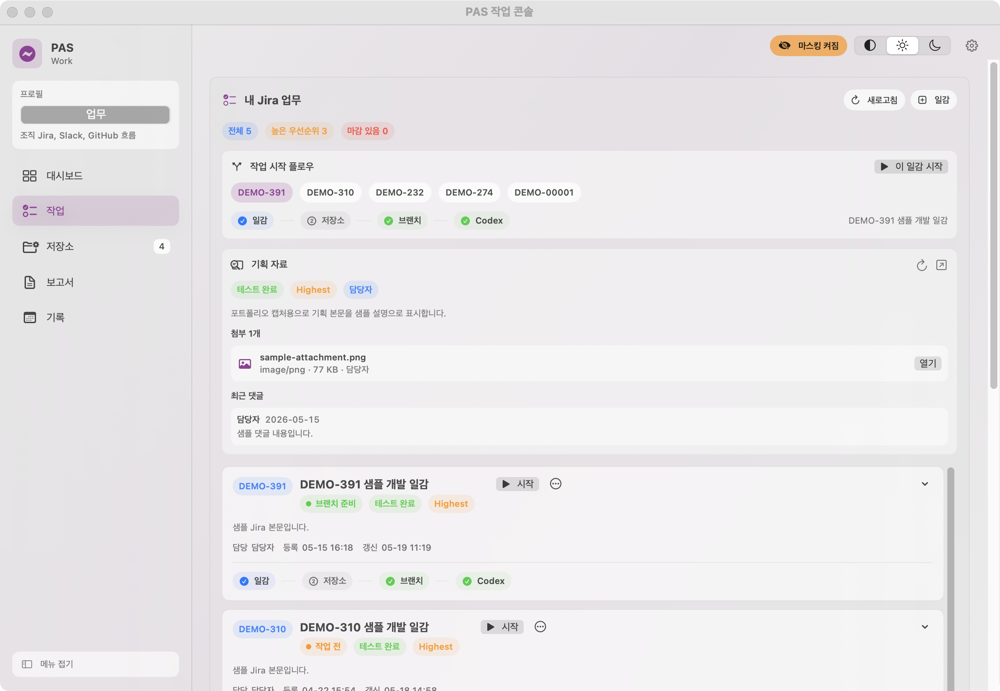
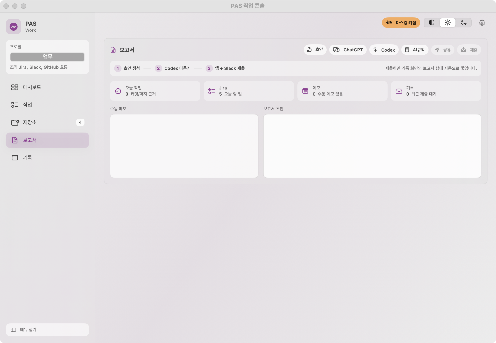
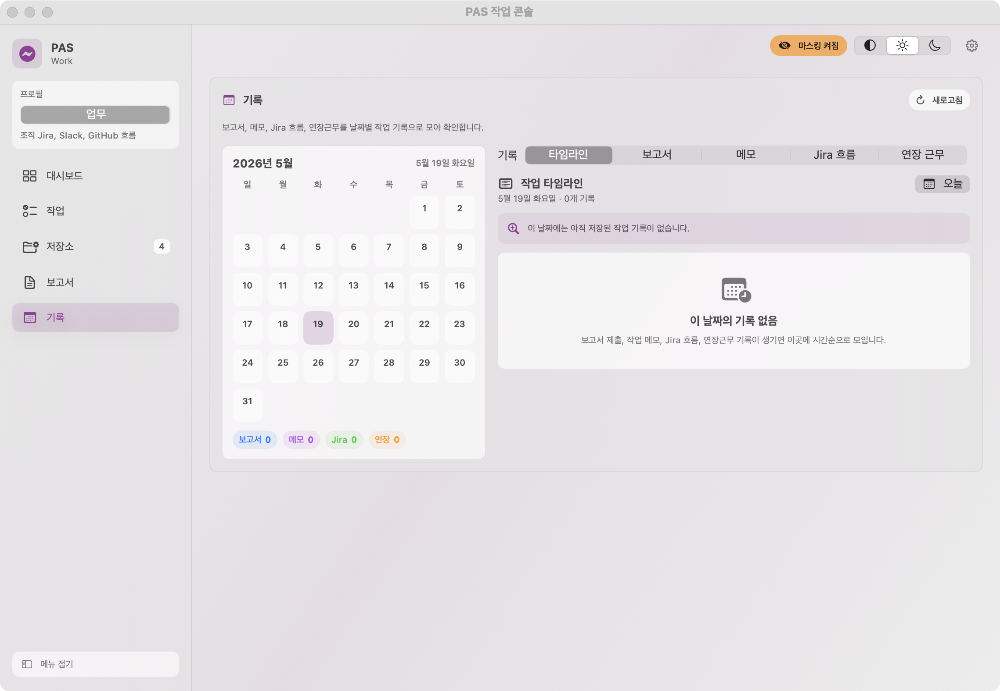

# DevPilot

DevPilot는 개발자의 하루 업무 흐름을 하나의 로컬 앱 안에서 이어주기 위해 만든 macOS 중심 개인 자동화 시스템입니다.

Jira 일감, 로컬 Git 저장소, Codex 작업 요청, Slack 보고, 빠른 메모, 연장근무 기록은 실제 개발 업무에서 계속 흩어집니다. DevPilot는 이 전환 비용을 줄이기 위해 오늘 해야 할 일을 확인하고, 작업을 시작하고, 근거를 남기고, 보고서와 기록으로 마무리하는 흐름을 하나의 메뉴바 앱으로 묶었습니다.

## 프로젝트 목표

이 프로젝트에서 보여주고 싶은 것은 단순한 TODO 앱이 아닙니다. 개발자가 실제로 하루 동안 오가는 도구들을 제품 형태로 엮고, 그 과정에서 필요한 자동화와 기록 구조를 어떻게 설계했는지를 보여주는 것이 핵심입니다.

| 목표 | 설명 |
| --- | --- |
| 업무 맥락 통합 | Jira 일감, 저장소, 브랜치, 커밋, 보고서를 하나의 흐름으로 연결 |
| 반복 작업 자동화 | 브랜치 준비, Codex 요청 프롬프트, 일일 보고서 초안 생성 |
| 로컬 우선 설계 | 업무 토큰과 기록을 로컬 설정과 로컬 상태로 관리 |
| 공개 문서화 | 마스킹 모드와 화면 캡처로 포트폴리오 설명 가능 |

## 대시보드


대시보드는 앱을 켰을 때 가장 먼저 보는 화면입니다. 오늘 할 일, 새 Jira 일감, 작업 중인 저장소, 정비가 필요한 저장소, Codex 상태, 보고서 상태를 요약합니다.

이 화면의 목적은 모든 정보를 펼쳐놓는 것이 아니라, 오늘 먼저 봐야 할 신호를 짧게 보여주는 것입니다. 개발자가 아침에 앱을 열었을 때 "어떤 일감을 시작해야 하는지", "어떤 저장소가 밀려 있는지", "보고서 작성 근거가 쌓이고 있는지"를 바로 판단할 수 있게 했습니다.

## 작업 화면



작업 화면은 Jira 일감에서 실제 개발 작업으로 넘어가는 중심 흐름입니다.

```text
Jira 일감 선택
-> 기획 본문, 첨부, 댓글 확인
-> 관련 저장소 연결
-> Jira 키 기반 브랜치 준비
-> Codex 작업 요청 프롬프트 생성
-> 개발, 커밋, PR, 보고서
```

DevPilot에서 중요한 점은 "브랜치를 만든다" 같은 단일 명령이 아니라, 명령 주변의 맥락을 함께 보존하는 것입니다. 어떤 Jira 일감에서 시작했는지, 어떤 저장소가 연결됐는지, 어떤 브랜치가 만들어졌는지, Codex에게 어떤 맥락을 넘겼는지가 하나의 기록으로 이어집니다.

## 저장소 관리


저장소 화면은 관리 중인 로컬 Git repository 상태를 확인하는 공간입니다.

| 항목 | 설명 |
| --- | --- |
| 기준 브랜치 | 저장소별 작업 기준 브랜치 |
| 현재 브랜치 | checkout된 브랜치와 작업 브랜치 여부 |
| 동기화 상태 | ahead, behind, pull, rebase 필요 여부 |
| 오늘 작업 | 오늘 발생한 커밋과 머지 |
| PR/릴리즈 | GitHub에서 확인한 PR과 최신 릴리즈 |

하나의 Jira 일감이 여러 저장소에 걸쳐 있을 때, 각 저장소의 브랜치와 커밋 상태를 한 화면에서 비교할 수 있게 만든 점이 핵심입니다.

## 보고서



보고서 화면은 오늘의 작업 근거를 바탕으로 일일 보고서 초안을 만드는 곳입니다.

DevPilot는 오늘 커밋, 머지, Jira 작업 맥락, 메모, 보고서 규칙을 모아 초안을 만들고, 사용자가 그 초안을 ChatGPT나 Codex에 전달해 다듬을 수 있게 합니다. AI API가 없어도 사용할 수 있도록 "근거 수집과 프롬프트 생성"을 앱의 기본 기능으로 두었습니다.

## 기록



기록 화면은 보고서, 메모, Jira 흐름, 연장근무 기록을 날짜별 타임라인으로 다시 확인하는 공간입니다.

개발 업무는 나중에 "그때 왜 그렇게 했는지"를 찾아야 할 때가 많습니다. DevPilot는 하루의 작업 근거를 보고서와 기록으로 보관해 개인 업무 히스토리로 활용할 수 있게 합니다.

## 아키텍처

DevPilot는 SwiftUI 앱과 Python CLI를 분리한 구조입니다.

```text
SwiftUI macOS 메뉴바 앱
-> DevPilotRunner 브리지
-> Python CLI: devpilot
-> Jira API / GitHub CLI / Slack API / 로컬 Git / 로컬 앱 상태
-> Codex CLI
-> GitHub Actions 태그 기반 macOS 릴리즈
```

| 계층 | 역할 |
| --- | --- |
| SwiftUI 앱 | macOS 네이티브 UI, 메뉴바 앱, 대시보드, 작업, 저장소, 보고서, 기록 |
| Python CLI | Jira, Git, Slack, 보고서, 연장근무 자동화 명령 |
| 로컬 상태 | 프로필, Jira-저장소 연결, 보고서, 메모, 연장근무 기록 |
| Codex CLI | AI 기반 작업 요청과 보고서 다듬기 |
| GitHub Actions | 태그 기반 macOS 앱 릴리즈 |

SwiftUI 앱은 사용자가 보는 제품 경험을 담당하고, Python CLI는 외부 API와 로컬 자동화를 담당합니다. 이렇게 나누면 앱 화면과 자동화 로직을 분리해 테스트하고 확장하기 쉽습니다.

## 공개 문서화를 위한 마스킹

DevPilot는 실제 업무 도구를 다루기 때문에 Jira 키, 저장소명, 사람 이름, 커밋 메시지, 로컬 경로가 노출될 수 있습니다. 그래서 공개용 캡처를 만들 때 사용할 수 있는 마스킹 모드를 두었습니다.

포트폴리오에 포함된 화면은 모두 마스킹 모드를 켠 상태로 촬영한 공개용 샘플입니다. 설정 화면처럼 이메일, 토큰, 로컬 경로가 직접 보일 수 있는 화면은 게시물에서 제외했습니다.

## 릴리즈 방식

DevPilot는 태그 기반 GitHub Release를 사용합니다.

```bash
git tag v0.1.x
git push origin v0.1.x
```

릴리즈 워크플로우는 Python CLI를 PyInstaller로 빌드하고, SwiftUI macOS 앱 번들을 조립한 뒤 `devpilot-macos-menubar-arm64.zip`을 GitHub Release에 첨부합니다.

## 포트폴리오 포인트

DevPilot는 특정 회사의 업무 데이터를 공개하지 않으면서도, 실제 개발자의 업무 흐름에서 생긴 문제를 제품으로 정리한 프로젝트입니다.

- SwiftUI 기반 macOS 네이티브 앱
- Python CLI 기반 자동화 백엔드
- Jira, GitHub, Slack, Git, Codex CLI 연동
- 업무용/개인용 프로필 분리
- 반복 가능한 Codex 작업 요청을 위한 구조화된 프롬프트 생성
- 날짜별 업무 기록과 보고서 저장
- 공개 문서화를 위한 마스킹 모드
- GitHub Actions 기반 macOS 앱 릴리즈

## 회고

DevPilot를 만들면서 가장 중요하게 본 것은 "자동화 스크립트를 많이 만든다"가 아니라 "업무 흐름이 끊기지 않게 만든다"였습니다.

개발자는 Jira, Git, Slack, AI 도구, 로컬 저장소 사이를 계속 이동합니다. DevPilot는 그 이동을 하나의 제품 경험으로 묶고, 하루가 끝났을 때 보고서와 기록으로 남기는 구조를 실험한 프로젝트입니다.
