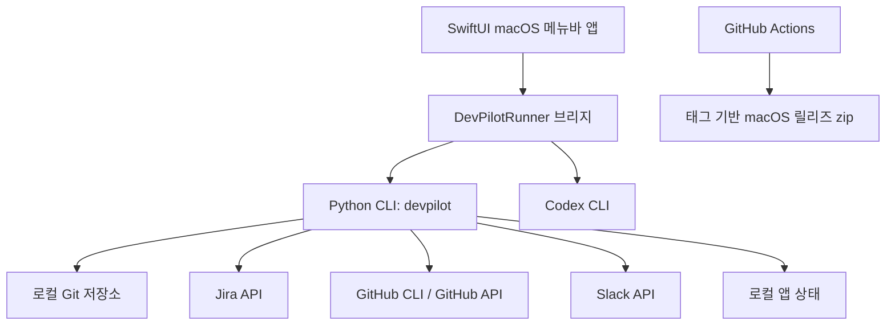

# DevPilot

**DevPilot**는 개발자의 하루 업무 흐름을 한 곳에서 관리하기 위해 만든 macOS 중심 개인 자동화 앱입니다.

Jira 일감, 로컬 Git 저장소, Codex 작업 요청, 업무 보고서, 빠른 메모, 연장근무 기록은 실제 개발 업무에서 자주 흩어지는 정보입니다. DevPilot는 이 흐름을 하나의 로컬 메뉴바 앱으로 묶어, 오늘 해야 할 일을 확인하고, 작업을 시작하고, 근거를 남기고, 보고서와 기록으로 마무리할 수 있도록 돕습니다.

> 포트폴리오 관점에서 DevPilot는 SwiftUI macOS 앱, Python 자동화 CLI, GitHub Actions 릴리즈, 외부 API 연동, AI 기반 개발 보조 흐름을 실제 개인 업무 문제에 맞춰 통합한 프로젝트입니다.

## 왜 만들었나

개발자의 일은 코드 작성만으로 끝나지 않습니다. 하나의 작업을 시작하려고 해도 Jira, Git 브랜치, 로컬 저장소, PR, Slack 보고, 메모, AI 도구를 계속 오가게 됩니다. DevPilot는 이 전환 비용을 줄이기 위해 만들었습니다.

DevPilot가 의도하는 기본 흐름은 다음과 같습니다.

```text
오늘 작업 확인
  -> Jira 일감과 저장소 연결
  -> 규칙에 맞는 작업 브랜치 생성
  -> Codex 작업 요청 프롬프트 준비
  -> Git 작업과 저장소 상태 추적
  -> 일일 보고서 작성 및 제출
  -> 날짜별 기록으로 보관
```

## 주요 기능

| 영역 | 제공 기능 | 목적 |
|---|---|---|
| 대시보드 | 오늘 할 일, 저장소 신호, Codex 상태, 보고서 상태 | 아침에 앱을 켰을 때 우선순위를 빠르게 파악 |
| Jira 작업 | 일감 목록, 기획 본문, 첨부, 댓글, 저장소 연결 | 작업 맥락을 코드 작업과 함께 유지 |
| 저장소 관리 | 기준 브랜치, 작업 브랜치, 변경분, rebase/pull 필요 여부, 오늘 커밋 | 로컬 저장소 상태를 작업 전에 확인 |
| Codex 연동 | Jira, 저장소, 메모, 컨벤션을 포함한 표준 작업 프롬프트 생성 | 반복적인 AI 작업 요청 품질을 일정하게 유지 |
| 보고서 | 초안 생성, Codex 다듬기, 제출, 로컬 기록 저장 | 하루 작업 내용을 보고 가능한 형태로 정리 |
| 기록 | 보고서, 메모, Jira 흐름, 연장근무의 날짜별 타임라인 | 개인 업무 히스토리를 다시 확인 |
| 프로필 | 업무용/개인용 프로필 분리 | 토큰, 저장소, 설정을 목적별로 분리 |
| 연장근무 | 날짜/시간 기반 연장근무 기록과 월별 예상 수당 계산 | 개인 근로 기록을 로컬에 보관 |

## 핵심 작업 흐름


DevPilot의 핵심은 명령 실행 자체가 아니라, 명령 주변의 맥락을 함께 보존하는 것입니다. 어떤 Jira 일감에서 시작했는지, 어떤 저장소가 연결되었는지, 어떤 브랜치가 만들어졌는지, 오늘 어떤 커밋이 있었는지, 어떤 보고서를 제출했는지를 하나의 흐름으로 이어갑니다.

## 화면 캡처와 사용 설명서

실제 앱 화면을 기준으로 한 사용 설명서는 [`docs/USER_MANUAL.md`](docs/USER_MANUAL.md)에 정리했습니다. 공개용 캡처는 앱의 `마스킹` 모드를 켠 상태로 촬영해 Jira 키, 저장소명, 사람 이름, 커밋 메시지 같은 업무 정보를 샘플 값으로 대체했습니다.

| 화면 | 캡처 | 보여줄 내용 |
|---|---|---|
| 대시보드 | [`devpilot-dashboard.png`](docs/assets/screenshots/devpilot-dashboard.png) | 오늘 상황판, Codex 상태, Jira/저장소 요약 |
| 작업 | [`devpilot-work.png`](docs/assets/screenshots/devpilot-work.png) | Jira 일감 선택, 기획 자료, 작업 시작 흐름 |
| 저장소 | [`devpilot-repositories.png`](docs/assets/screenshots/devpilot-repositories.png) | 기준 브랜치, 작업 브랜치, 오늘 커밋, PR/릴리즈 |
| 보고서 | [`devpilot-report.png`](docs/assets/screenshots/devpilot-report.png) | 초안 생성, Codex 다듬기, 제출 흐름 |
| 기록 | [`devpilot-records.png`](docs/assets/screenshots/devpilot-records.png) | 날짜별 보고서/메모/Jira/연장근무 기록 |

설정 화면처럼 이메일, 토큰, 로컬 경로가 직접 보일 수 있는 화면은 공개용 캡처에서 제외합니다.

## 제품 구성

DevPilot는 매일 반복되는 개발자의 작은 순간들을 기준으로 설계했습니다.

### 1. 하루 시작

대시보드는 오늘 개발 상황을 짧게 보여줍니다.

- 내게 할당된 Jira 일감
- 새로 감지된 Jira 일감
- 작업 중인 저장소
- 정비가 필요한 저장소
- Codex 사용 가능 상태
- 연결된 Jira와 브랜치 진행 수

목표는 모든 정보를 보여주는 것이 아니라, **지금 먼저 봐야 할 것이 무엇인지** 알려주는 것입니다.

### 2. Jira 일감 시작

Jira 일감을 선택하면 DevPilot는 다음 흐름을 지원합니다.

- 기획 본문, 첨부, 최근 댓글 확인
- 하나 이상의 관리 저장소 연결
- Jira 키가 포함된 작업 브랜치 생성
- Codex 작업 요청 프롬프트 생성
- 일감과 저장소 연결 상태 보관

작업 상태는 다음 흐름으로 표시됩니다.

```text
작업 전 -> 저장소 연결 -> 브랜치 준비 -> Codex 작업 요청
```

### 3. 로컬 저장소 관리

DevPilot는 로컬 저장소 상태를 중요한 업무 정보로 다룹니다. 관리 저장소마다 다음 정보를 확인할 수 있습니다.

- 기준 브랜치와 현재 브랜치
- 변경된 파일 수
- ahead/behind 상태
- rebase 또는 pull 필요 여부
- 오늘 커밋과 머지 기록
- PR 및 릴리즈 요약
- 자동 처리 결과

하나의 Jira 일감이 여러 저장소에 걸쳐 있을 때 특히 유용합니다.

### 4. Codex 작업 요청

DevPilot는 Codex에게 보낼 작업 요청을 만들 때 필요한 맥락을 함께 구성합니다.

- 사용자가 요청한 작업
- Jira 키와 요약
- Jira 기획 본문, 첨부, 댓글
- 연결된 저장소 목록
- `AGENTS.md` 같은 저장소별 컨벤션 파일
- 최근 작업 메모
- 기대하는 결과 형식

매번 같은 설명을 반복하지 않고, 일관된 품질의 AI 작업 요청을 만들기 위한 구조입니다.

### 5. 보고서와 기록

DevPilot는 다음 근거를 바탕으로 일일 보고서 초안을 만들 수 있습니다.

- 오늘 커밋과 머지
- Jira 작업 맥락
- 수동 메모
- 로컬 작업 메모
- 보고서 작성 규칙

보고서는 다듬고 제출한 뒤 로컬 기록으로 저장됩니다. 기록 화면에서는 날짜별로 보고서, 메모, Jira 흐름, 연장근무 기록을 함께 볼 수 있어 개인 업무 히스토리로 활용할 수 있습니다.

## 아키텍처



| 계층 | 역할 |
|---|---|
| SwiftUI 앱 | macOS 네이티브 UI, 메뉴바 앱, 대시보드, 설정, 로컬 창 |
| Python CLI | Jira/Git/Slack/보고서/연장근무 자동화 명령 |
| 로컬 상태 | 프로필, Jira-저장소 연결, 보고서, 메모, 연장근무 기록 |
| Codex CLI | AI 기반 작업 요청 및 개발 보조 흐름 |
| GitHub Actions | 태그 기반 빌드와 GitHub Release 배포 |

## 프로젝트 구조

```text
apps/macos/        SwiftUI 메뉴바 앱
src/               Python 자동화 CLI와 연동 로직
examples/          예시 설정, 담당자, 보고서 규칙 파일
scripts/           로컬 헬퍼 스크립트
ops/launchd/       macOS launchd 템플릿
docs/              제품 기획과 사용 문서
.github/           태그 기반 릴리즈 workflow와 릴리즈 노트
```

## 로컬 개발

```bash
just setup
just install-dev
just check
just macos-app-build
```

런타임 설정은 아래 경로에 생성됩니다.

```text
~/Library/Application Support/DevPilot/
```

예시 파일은 [`examples/`](examples/)에 있습니다.

## 릴리즈 방식

DevPilot는 태그 기반 GitHub Release를 사용합니다.

```bash
git push origin main
git tag v0.1.x
git push origin v0.1.x
```

`v*` 태그가 push되면 다음 과정이 실행됩니다.

1. GitHub Actions가 Python CLI를 PyInstaller로 빌드합니다.
2. SwiftUI macOS 앱을 빌드합니다.
3. `DevPilot.app` 번들을 조립합니다.
4. 앱을 `devpilot-macos-menubar-arm64.zip`으로 압축합니다.
5. GitHub Release를 만들고 zip 파일을 첨부합니다.

릴리즈 노트는 아래 경로에 작성할 수 있습니다.

```text
.github/release-notes/v0.1.x.md
```

## 포트폴리오 포인트

DevPilot는 단순 예제성 프로젝트가 아니라, 실제 개발자의 업무 흐름에서 생긴 불편을 해결하기 위해 만든 로컬 도구입니다.

강조할 수 있는 기술적 포인트는 다음과 같습니다.

- SwiftUI 기반 macOS 네이티브 앱
- Python CLI 기반 자동화 백엔드
- Jira, GitHub, Slack, Git, Codex, 선택적 OpenAI API 연동
- 업무용/개인용 프로필 분리
- 외부 시스템 토큰을 로컬 설정으로 관리
- 반복 가능한 Codex 작업 요청을 위한 구조화된 프롬프트 생성
- 날짜별 업무 기록과 보고서 저장
- GitHub Actions 기반 릴리즈 자동화
- 실제 사용 피드백을 반영한 제품형 개선 과정

## 문서

- [상세 사용법](docs/USAGE.md)
- [제품 기획안](docs/PRODUCT_PLAN.md)

## 현재 상태

DevPilot는 현재 **개인 실사용 베타**에 가깝습니다. 매일 개발 업무 옆에 켜두고 사용할 수 있는 수준까지 왔고, 실제 사용 과정에서 계속 다듬는 중입니다.

다음 개선 후보는 다음과 같습니다.

- 화면 캡처 기반 사용 매뉴얼
- 실패 상황별 복구 가이드
- 주간/월간 업무 회고 기능
- 저장소별 Codex 작업 템플릿 강화
- 큰 SwiftUI 화면의 추가 분리
