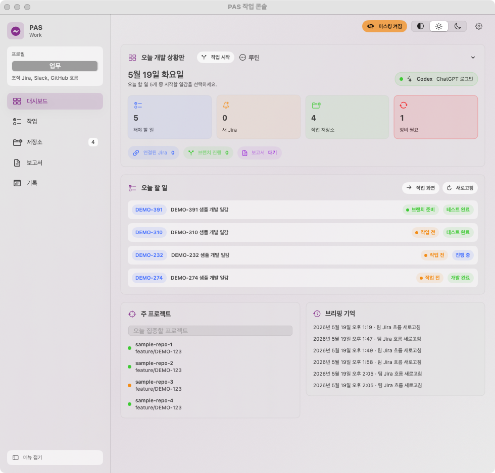
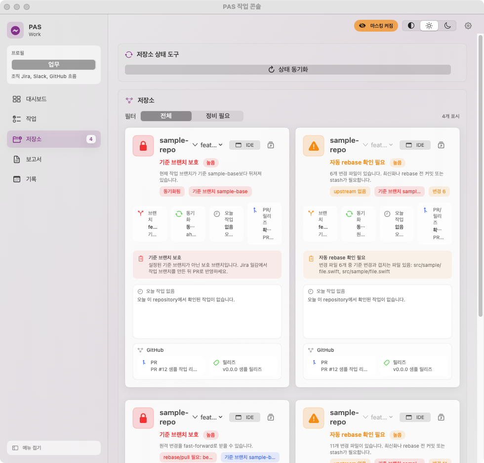

# DevPilot 사용 설명서

DevPilot는 개발자가 하루 업무를 시작하고, Jira 일감과 저장소를 연결하고, Codex 작업 요청과 보고서 작성까지 이어갈 수 있도록 만든 macOS 로컬 업무 콘솔입니다.

이 문서는 실제 앱 화면을 기준으로 주요 사용 흐름을 설명합니다. 공개용 캡처에는 `마스킹` 모드를 켜서 Jira 키, 저장소명, 사람 이름, 커밋 메시지 같은 업무 정보를 샘플 값으로 대체했습니다.

## 빠른 시작

1. DevPilot 앱을 실행합니다.
2. 상단의 `마스킹` 버튼을 켜면 포트폴리오나 문서용 캡처에 민감 정보가 노출되지 않습니다.
3. 좌측 메뉴에서 `대시보드`, `작업`, `일감 처리`, `저장소`, `보고서`, `기록`을 이동합니다.
4. 하루 작업은 `작업` 화면에서 Jira 일감을 선택하거나 `일감 처리` 화면에서 승인 흐름으로 시작합니다.
5. 작업이 끝나면 `보고서` 화면에서 초안을 만들고, `기록` 화면에서 날짜별 기록을 확인합니다.

## 1. 대시보드



대시보드는 앱을 켰을 때 가장 먼저 보는 화면입니다. 오늘의 개발 상황을 한눈에 파악하는 것이 목적입니다.

| 영역 | 설명 |
|---|---|
| 오늘 개발 상황판 | 오늘 할 일, 새 Jira, 작업 저장소, 정비 필요 저장소 수를 요약합니다. |
| Codex 상태 | Codex CLI가 사용 가능한지, 어떤 인증 방식으로 동작하는지 표시합니다. |
| 오늘 할 일 | Jira에서 가져온 오늘의 주요 일감을 간단히 보여줍니다. |
| 주 프로젝트 | 현재 집중할 저장소와 브랜치 상태를 확인합니다. |
| 브리핑 기억 | 브리핑, 새로고침, 보고서 반영 같은 주요 작업 흔적을 남깁니다. |

대시보드는 모든 상세 정보를 펼쳐놓는 화면이 아니라, 오늘 무엇부터 봐야 하는지 알려주는 시작 화면입니다.

## 2. 작업 화면


작업 화면은 Jira 일감에서 실제 개발 작업으로 넘어가는 중심 흐름입니다.

| 단계 | 기능 |
|---|---|
| 일감 선택 | 내게 할당된 Jira 일감을 선택합니다. |
| 기획 자료 확인 | Jira 본문, 첨부, 최근 댓글을 앱 안에서 확인합니다. |
| 저장소 연결 | 일감과 관련된 로컬 저장소를 연결합니다. |
| 브랜치 준비 | Jira 키가 포함된 작업 브랜치를 생성하거나 상태를 확인합니다. |
| Codex 작업 요청 | 연결된 일감, 저장소, 컨벤션을 바탕으로 Codex 작업 요청을 준비합니다. |

권장 흐름은 다음과 같습니다.

```text
Jira 일감 선택
  -> 저장소 연결
  -> 브랜치 생성
  -> Codex 작업 요청
  -> 개발 및 커밋
  -> PR / 머지
```

`시작` 버튼은 이 흐름을 가능한 한 한 번에 이어주기 위한 진입점입니다. 저장소를 자동으로 결정할 수 없으면 연결 창을 열어 사용자가 직접 지정하도록 유도합니다.

## 3. 일감 처리 콘솔


일감 처리 콘솔은 Jira 또는 수동 등록 일감을 `수신 -> 분석 -> repository 확정 -> workspace 준비 -> 구현 -> 테스트 -> 보고` 흐름으로 관리하는 화면입니다.

| 영역 | 설명 |
|---|---|
| 요약 카드 | 전체 일감 수, 프로젝트 수, 승인 대기, 진행 중 상태를 요약합니다. |
| 프로젝트 목록 | 일감을 프로젝트 단위로 묶어 보여줍니다. Jira 프로젝트 키가 없으면 Inbox로 분류합니다. |
| 일감 목록 | 승인 대기, 진행, 보고 등 현재 상태를 표시합니다. |
| 처리 흐름 | 선택한 일감의 단계별 승인 상태와 다음 행동을 보여줍니다. |
| AI 작업 지휘관 | 분석, 작업 계획, repository 후보, 브랜치 전략, 테스트 추천, 보고 초안을 한 화면에 정리합니다. |

권장 사용 흐름은 다음과 같습니다.

```text
일감 수신
  -> AI 1차 분석 승인
  -> repository 후보 확인
  -> 일감 workspace 준비
  -> Codex 작업 루트 열기
  -> 테스트 결과 기록
  -> 보고 등록
```

이 화면은 작업이 여러 저장소에 걸쳐 있거나, 구현 전에 요구사항을 한 번 정리해야 하는 일감에서 특히 유용합니다. DevPilot는 각 단계의 결과를 로컬 상태로 남겨서 다음 브리핑, 보고서, 기록 화면에서 다시 이어볼 수 있게 합니다.

## 4. AI 작업 지휘관


AI 작업 지휘관은 선택한 일감의 현재 상태를 기준으로 다음 판단을 돕는 보드입니다.

| 카드 | 확인 내용 |
|---|---|
| 진행률 | 일감 단계 중 어디까지 완료됐는지 보여줍니다. |
| 분석 | Codex 1차 분석 또는 로컬 분석 기록을 요약합니다. |
| 작업 계획 | 현재 상태에서 다음에 실행할 일을 정리합니다. |
| Repository 후보 | 연결된 저장소와 Git 상태를 기준으로 작업 범위를 확인합니다. |
| 브랜치 전략 | 기준 브랜치와 일감 브랜치가 맞는지 점검합니다. |
| 테스트 추천 | 어떤 테스트부터 실행해야 할지 제안합니다. |
| 컨벤션 점검 | 브랜치명, 커밋 메시지, 테스트/보고 기록 누락을 표시합니다. |
| 보고 초안 | 완료 후 공유할 수 있는 업무 보고 문장을 준비합니다. |

이 화면의 목적은 AI 결과를 자동으로 확정하는 것이 아닙니다. 사람이 승인해야 할 지점과 아직 부족한 근거를 먼저 드러내서, Codex와 함께 작업하더라도 최종 판단은 개발자가 유지하도록 만드는 데 있습니다.

## 5. Codex 작업 컨텍스트

DevPilot는 Codex에게 작업을 넘길 때 단순히 “이 일감 해줘”라고 요청하지 않습니다. 앱이 먼저 일감과 repository 정보를 모아 작업 컨텍스트 파일을 만들고, 일감 전용 workspace를 Codex 작업 루트로 열어줍니다.

| 컨텍스트 | 포함되는 내용 |
|---|---|
| 일감 정보 | Jira 키, 요약, 본문, 댓글, 완료 조건 |
| 분석 기록 | As-Is/To-Be, 영향 범위, 리스크, 확인 질문 |
| 저장소 정보 | 관련 repository, 기준 브랜치, 현재 브랜치, 변경 파일 |
| 프로젝트 규칙 | `AGENTS.md`, 테스트 명령, 커밋/브랜치 컨벤션 |
| 작업 기록 | 테스트 결과, 보고 초안, 이전 승인 단계 |

이 방식은 AI 활용 경험을 “대화 한 번”으로 끝내지 않고, 실제 개발 워크플로우 안에 넣기 위한 구조입니다. Codex가 작업한 뒤에도 테스트 결과와 보고 내용은 다시 DevPilot 기록으로 돌아옵니다.

공개 문서에 실제 Codex 화면을 추가할 때는 샘플 데이터만 포함된 Codex 윈도우를 열고, `LMS-493-context.md`와 관련 repository가 보이는 화면만 캡처합니다. 사이드바의 개인 대화 기록이나 회사 업무 화면은 포함하지 않습니다.

## 6. 저장소 화면



저장소 화면은 관리 중인 로컬 Git repository 상태를 확인하는 곳입니다.

| 표시 항목 | 설명 |
|---|---|
| 기준 브랜치 | repository별 작업 기준 브랜치를 보여줍니다. |
| 현재 브랜치 | 지금 checkout된 브랜치와 작업 브랜치 여부를 보여줍니다. |
| 동기화 상태 | ahead/behind, pull 가능, rebase 필요 여부를 보여줍니다. |
| 오늘 작업 | 오늘 발생한 커밋과 머지를 시간순으로 확인합니다. |
| PR/릴리즈 | GitHub에서 확인한 PR 및 최신 릴리즈 정보를 요약합니다. |
| 자동 처리 결과 | 자동 rebase/pull이 처리되었거나 확인이 필요한 이유를 표시합니다. |

이 화면은 여러 repository를 동시에 다루는 작업에서 특히 유용합니다. 예를 들어 하나의 Jira 일감이 프론트엔드와 백엔드 repository를 함께 수정해야 할 때, 각 저장소의 브랜치와 커밋 상태를 한 화면에서 비교할 수 있습니다.

## 7. 보고서 화면


보고서 화면은 오늘의 작업 근거를 바탕으로 보고서 초안을 만드는 곳입니다.

| 단계 | 설명 |
|---|---|
| 초안 | 오늘 커밋, 머지, Jira, 메모를 모아 보고서 초안을 만듭니다. |
| ChatGPT | 구독형 ChatGPT에 전달하기 좋은 프롬프트 형태로 정리합니다. |
| Codex | 로컬 Codex 작업 요청 규칙에 맞춰 보고서 문장을 다듬습니다. |
| 공유 | 작성된 내용을 Slack 등에 공유할 수 있는 흐름을 제공합니다. |
| 제출 | 작성한 보고서를 앱 기록으로 저장합니다. |

보고서 기능은 AI API 키가 없어도 사용할 수 있도록 설계했습니다. 앱이 먼저 근거를 모아 초안을 만들고, 사용자는 그 초안을 ChatGPT나 Codex에 전달해 더 자연스럽게 다듬을 수 있습니다.

## 8. 기록 화면


기록 화면은 보고서, 메모, Jira 흐름, 연장근무 기록을 날짜별로 확인하는 곳입니다.

| 탭 | 설명 |
|---|---|
| 타임라인 | 해당 날짜의 주요 작업 기록을 시간순으로 봅니다. |
| 보고서 | 제출한 일일 보고서를 다시 확인합니다. |
| 메모 | 작업 중 남긴 빠른 메모를 모아 봅니다. |
| Jira 흐름 | 팀 Jira 흐름과 상태 변경을 날짜 기준으로 확인합니다. |
| 연장 근무 | 기록한 연장근무 시간과 예상 수당 정보를 확인합니다. |

기록 화면은 하루가 끝난 뒤 회고하거나, 나중에 특정 작업의 근거를 찾을 때 쓰는 공간입니다.

## 공개용 캡처 체크리스트

포트폴리오나 외부 문서에 화면을 넣기 전에는 아래 항목을 확인합니다.

- 상단 `마스킹 켜짐` 상태인지 확인합니다.
- 설정 화면처럼 이메일, 토큰, 로컬 경로가 직접 보이는 화면은 캡처하지 않습니다.
- 오류 모달을 캡처할 때는 원문에 회사 도메인, 사용자명, 파일 경로가 남아 있지 않은지 확인합니다.
- 필요한 경우 실제 데이터 대신 샘플 Jira 키와 샘플 저장소명으로 화면을 준비합니다.

## 개발자 관점에서 볼 포인트

DevPilot는 단순한 TODO 앱이 아니라, 개발자의 실제 업무 흐름을 작은 자동화 단위로 연결한 앱입니다.

- SwiftUI 기반 macOS 네이티브 UI
- Python CLI와 Swift 앱 사이의 작업 브리지
- Jira, GitHub, Slack, Codex CLI 연동
- 로컬 상태 기반의 Jira-저장소 연결 관리
- 태그 기반 GitHub Actions 릴리즈
- 공개 문서화를 위한 민감 정보 마스킹 모드

이 구조 덕분에 혼자 쓰는 개인 개발 도구이면서도, 포트폴리오에서는 실무 문제를 제품 형태로 정리한 사례로 설명할 수 있습니다.
