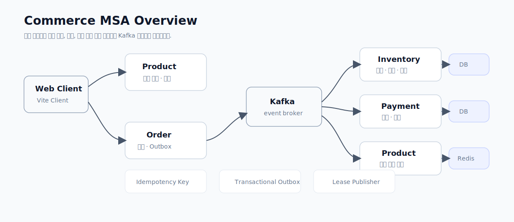
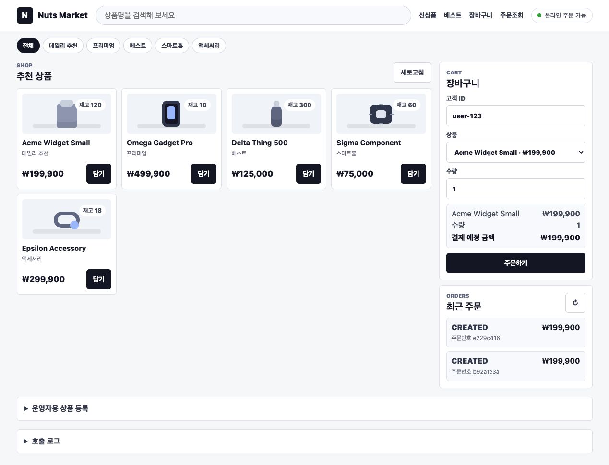
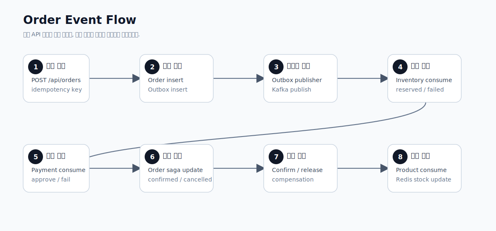
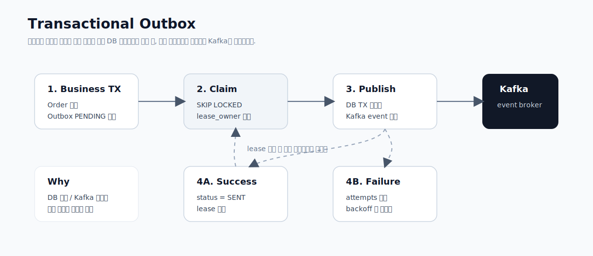
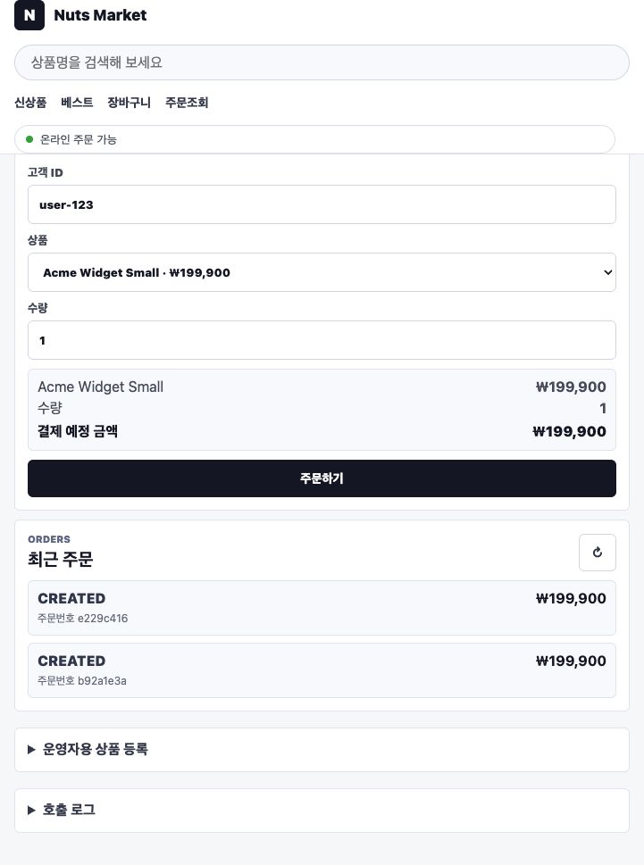

# Kotlin Commerce Core

커머스 백엔드를 마이크로서비스로 나누면 가장 먼저 부딪히는 문제는 "서비스를 어떻게 나눌까"가 아닙니다. 주문은 저장됐는데 메시지 발행에 실패하면 어떻게 할지, 같은 이벤트가 두 번 들어오면 어떻게 할지, 여러 인스턴스의 publisher가 같은 outbox 레코드를 동시에 집어가면 어떻게 할지 같은 신뢰성 문제가 먼저 나타납니다.

Kotlin Commerce Core는 주문, 재고, 결제, 상품 서비스를 나누고 Kafka 이벤트로 연결한 커머스 백엔드 포트폴리오입니다. 단순히 서비스를 여러 개 띄우는 것보다, Transactional Outbox, Lease, Idempotency, Redis 캐시처럼 분산 환경에서 필요한 패턴을 직접 구현하는 데 초점을 뒀습니다.

## 프로젝트 목표

이 프로젝트에서 보여주고 싶었던 것은 "MSA 구조를 만들었다"가 아니라 "분산 환경에서 데이터 정합성과 메시지 신뢰성을 어떻게 다뤘는가"입니다.

핵심 목표는 세 가지였습니다.

| 목표 | 설명 |
| --- | --- |
| 주문 이벤트 흐름 구현 | 주문 생성 후 재고 예약, 결제 처리, 주문 상태 반영까지 이벤트로 연결 |
| 메시지 신뢰성 확보 | DB 저장과 이벤트 발행 사이의 간극을 Transactional Outbox로 보완 |
| 중복 처리 방어 | Idempotency-Key와 eventId 기반 멱등 처리 적용 |

## 한눈에 보는 구현 포인트

| 포인트 | 구현 방향 |
| --- | --- |
| 주문 생성 안정성 | Idempotency-Key로 중복 주문 생성 방어 |
| 이벤트 신뢰성 | 주문 저장 트랜잭션 안에서 Outbox 레코드 저장 |
| Publisher 경합 제어 | leaseOwner, leaseUntil로 발행 대상 선점 |
| Consumer 멱등성 | eventId 기반 처리 이력 저장 |
| 로컬 재현성 | Docker Compose로 Kafka, Redis, PostgreSQL, 4개 서비스 실행 |

## 시스템 개요



서비스는 주문 생성 이후 재고 예약, 결제 처리, 상품 캐시 갱신까지 이벤트 기반으로 이어집니다.

| Service | Responsibility |
| --- | --- |
| `order-service` | 주문 생성, Idempotency-Key 처리, Outbox 기록 |
| `inventory-service` | 재고 예약, 확정, 해제 |
| `payment-service` | 결제 승인/실패 처리 |
| `product-service` | 상품 조회와 Redis 캐시 |

이 구조에서 각 서비스는 자신의 DB를 소유합니다. 다른 서비스의 테이블을 직접 수정하지 않고, 이벤트를 통해 상태 변화를 전달합니다.

## 웹 클라이언트를 붙인 이유



백엔드 아키텍처 프로젝트는 API 호출 예시만 있으면 읽는 사람이 흐름을 상상해야 합니다. 그래서 주문 흐름을 직접 확인할 수 있는 브라우저 웹 클라이언트를 붙였습니다.

화면에서는 상품을 조회하고, 주문을 생성하고, 최근 주문을 확인할 수 있습니다. 이 UI는 화려한 프론트엔드가 목적이 아니라, 주문 이벤트 흐름을 눈으로 따라갈 수 있게 하는 장치입니다.

## 주문 이벤트 흐름



주문 생성 흐름은 다음과 같습니다.

1. 클라이언트가 `POST /orders`를 호출합니다.
2. `order-service`는 `Idempotency-Key`를 확인합니다.
3. 주문 데이터를 저장하면서 같은 트랜잭션에 Outbox 레코드를 기록합니다.
4. Outbox Publisher가 발행 가능한 레코드를 선점합니다.
5. Kafka로 주문 생성 이벤트를 발행합니다.
6. `inventory-service`와 `payment-service`가 이벤트를 소비합니다.
7. 처리 결과 이벤트가 다시 주문 상태에 반영됩니다.

여기서 중요한 점은 주문 저장과 Kafka 발행을 하나의 로컬 트랜잭션으로 묶을 수 없다는 것입니다. 그래서 주문 저장 시점에는 Kafka에 직접 보내지 않고, Outbox 테이블에 먼저 기록합니다.

## Transactional Outbox



Transactional Outbox는 DB 저장과 메시지 발행 사이의 불일치를 줄이기 위한 패턴입니다.

```text
주문 저장 트랜잭션
-> orders insert
-> outbox_events insert
-> commit

별도 publisher
-> outbox_events 조회
-> Kafka 발행
-> published 처리
```

이렇게 하면 주문은 저장됐는데 이벤트 기록이 없는 상태를 피할 수 있습니다. Kafka 발행이 실패하더라도 Outbox 레코드는 남아 있으므로 재시도할 수 있습니다.

## Lease로 중복 발행 줄이기

Outbox Publisher가 하나만 실행된다면 단순 조회 후 발행도 가능합니다. 하지만 실제 운영에서는 여러 인스턴스가 동시에 떠 있을 수 있습니다. 그러면 여러 publisher가 같은 outbox 레코드를 집어가 중복 발행할 위험이 있습니다.

그래서 claim-and-lock 방식의 lease를 적용했습니다.

```text
발행 대기 이벤트 조회
-> leaseOwner, leaseUntil 갱신
-> lease를 잡은 publisher만 Kafka 발행
-> 성공 시 published 처리
```

이 구조는 완벽히 중복을 없애기보다, 중복 가능성을 줄이고 consumer가 멱등하게 처리할 수 있는 기반을 만듭니다.

## Idempotency

주문 생성 API에는 `Idempotency-Key`를 사용했습니다. 클라이언트가 네트워크 문제로 같은 요청을 다시 보내더라도 중복 주문이 생기지 않도록 하기 위한 장치입니다.

이벤트 소비 측면에서는 eventId를 기준으로 이미 처리한 이벤트인지 확인하는 방식으로 중복 처리를 방어합니다. 분산 시스템에서는 "한 번만 전달"을 기대하기보다, "두 번 와도 결과가 망가지지 않게" 만드는 것이 더 현실적이라고 봤습니다.

## Product 캐시와 재고 이벤트

`product-service`는 상품 조회 성능을 위해 Redis 캐시를 사용할 수 있도록 구성했습니다. 재고 변경 이벤트가 발생하면 상품 조회 캐시를 갱신하거나 무효화할 수 있습니다.

커머스 서비스에서 상품 조회는 읽기 트래픽이 많고, 주문과 재고 변경은 쓰기 이벤트가 중요합니다. 이 둘을 분리해 상품 조회 성능과 재고 정합성 사이의 균형을 설명할 수 있게 했습니다.

## 주문 확인 화면



웹 클라이언트는 서비스가 여러 개로 나뉘어 있어도 사용자가 보는 흐름은 하나의 주문 경험으로 이어진다는 점을 보여줍니다. 상품 선택, 주문 생성, 최근 주문 확인을 같은 화면에서 확인할 수 있어 이벤트 기반 흐름을 설명할 때 보조 자료로 쓰기 좋습니다.

## 로컬 재현 환경

이 프로젝트는 Docker Compose로 Kafka, Redis, PostgreSQL, 각 서비스를 함께 띄울 수 있게 구성했습니다.

```text
Kafka / Zookeeper
Redis
order-postgres
inventory-postgres
payment-postgres
product-postgres
order-service
inventory-service
payment-service
product-service
```

서비스가 많아지면 실행 난이도가 올라가기 때문에, 포트폴리오에서는 로컬 재현 가능성이 중요하다고 봤습니다.

## 블로그 포스팅 패키지

Kotlin Commerce Core도 Portfolio Hub에 게시할 수 있도록 블로그 패키지 구조를 추가했습니다.

```text
blog/article.md
blog/images/*
.portfolio/manifest.json
-> dist/portfolio-package/
-> S3 portfolio-feed/kotlin-commerce-core/
```

포스팅 업로드는 수동 GitHub Actions 워크플로우로만 실행합니다. 아키텍처 글은 코드가 바뀔 때마다 자동 게시되는 것보다, 글과 이미지가 정리된 시점에 명시적으로 게시하는 편이 더 안전하다고 봤습니다.

## 회고

이 프로젝트는 "서비스를 여러 개로 나눴다"보다 "나눈 뒤 생기는 문제를 어떻게 다뤘다"에 초점을 둔 포트폴리오입니다.

MSA는 구조 자체가 목적이 되기 쉽습니다. 하지만 실제로 중요한 것은 메시지 발행 실패, 중복 이벤트, 재시도, 멱등성, 캐시 무효화처럼 운영 중에 터지는 문제입니다. Kotlin Commerce Core는 그런 문제들을 커머스 주문 흐름 안에 넣어 설명하기 위해 만든 프로젝트입니다.

나중에 더 확장한다면 Saga 보상 트랜잭션, DLQ, OpenTelemetry trace, consumer lag 모니터링, 재처리 운영 화면까지 붙여볼 수 있습니다.
