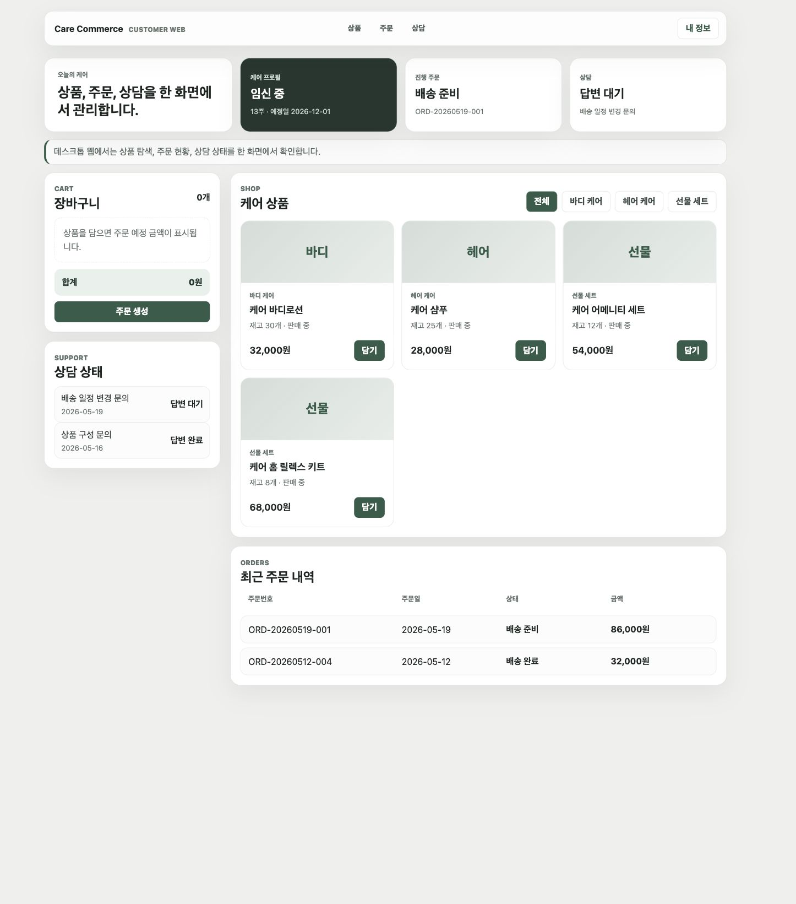
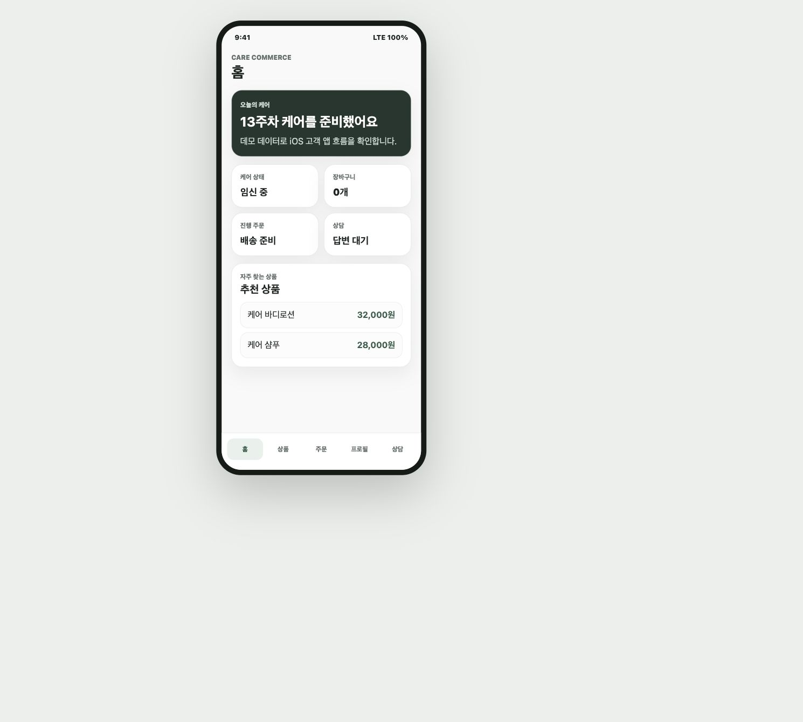
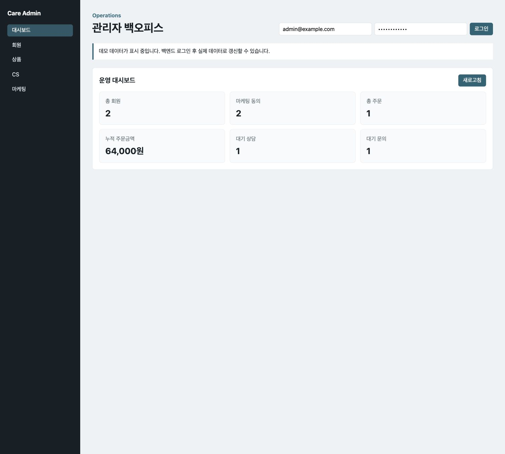

# Care Commerce Platform

임신, 출산, 육아처럼 민감하고 개인적인 생애 이벤트를 다루는 서비스는 단순히 상품을 보여주고 주문을 받는 커머스와 다르게 설계되어야 합니다. 사용자는 자신의 상태를 기록하고 상담을 남기며, 운영자는 그 정보를 바탕으로 CS, 상품 운영, 마케팅 동의 고객 관리, 감사 로그를 함께 다뤄야 합니다.

Care Commerce Platform은 이런 케어 커머스 운영 흐름을 포트폴리오용으로 재구성한 프로젝트입니다. 특정 회사 코드나 실제 데이터를 사용하지 않고, 고객 데스크톱 웹, iOS 앱, 관리자 백오피스, Spring Boot API 서버를 분리해 하나의 운영 시스템처럼 동작하도록 만들었습니다.

## 왜 이 프로젝트를 만들었나

이 프로젝트의 목표는 "상품 CRUD를 구현했다"가 아닙니다. 고객이 상품을 탐색하고 장바구니에 담고 주문을 만들며 상담을 남기는 흐름이, 운영자 화면의 회원 관리, 상품 관리, CS 처리, 마케팅 대상 조회, 감사 로그로 어떻게 이어지는지를 보여주는 것이 핵심입니다.

특히 모성 케어 도메인은 개인정보와 민감정보를 다룰 가능성이 높습니다. 그래서 고객 화면과 관리자 화면을 단순히 같은 API에 붙이지 않고, 접근 경계와 감사 가능한 운영 흐름을 분리하는 데 집중했습니다.

```text
고객 데스크톱 웹 -> client-api -> 주문, 상담, 프로필
iOS 앱          -> client-api -> 모바일 고객 경험
관리자 웹       -> admin-api  -> 회원, 상품, CS, 마케팅, 감사 로그
```

## 실행 단위를 나눈 이유

프로젝트는 하나의 레포 안에 있지만 실행 단위는 네 개로 나눴습니다.

| 실행 단위 | 역할 |
| --- | --- |
| `desktop-web` | PC 고객용 상품 탐색, 장바구니, 주문 현황, 상담 상태 |
| `ios-app` | SwiftUI 기반 네이티브 iOS 고객 앱 |
| `admin-web` | 운영자용 대시보드, 회원, 상품, CS, 마케팅 관리 |
| `backend` | 사용자 API와 관리자 API를 제공하는 Spring Boot 서버 |

실제 운영 환경이라면 고객용 웹, 모바일 앱, 관리자 백오피스, API 서버는 배포 방식과 장애 영향 범위가 다릅니다. 그래서 포트폴리오에서도 처음부터 실행 단위를 분리해 설계했습니다.

## 고객 데스크톱 웹

데스크톱 고객 웹은 넓은 화면에서 상품, 장바구니, 주문, 상담 상태를 한 번에 볼 수 있도록 구성했습니다.



첫 화면을 마케팅 랜딩 페이지처럼 만들지 않았습니다. 포트폴리오에서 보여주고 싶었던 것은 "서비스를 소개하는 화면"이 아니라 "실제 사용자가 반복적으로 쓰는 화면"이었기 때문입니다.

고객은 상품을 확인하고 장바구니에 담은 뒤 주문으로 넘어갑니다. 주문 이후에는 상담 요청이나 케어 프로필 수정처럼 고객 상태와 연결된 기능으로 이어집니다.

설계하면서 중요하게 본 점은 다음과 같습니다.

- 상품 목록과 장바구니 합계를 같은 흐름 안에서 확인할 수 있게 구성
- iOS 앱과 같은 고객 API를 사용하되 데스크톱에 맞는 화면 밀도 적용
- 주문, 상담, 프로필이 서로 끊어지지 않고 하나의 고객 여정처럼 보이도록 구성

## iOS 고객 앱

iOS 앱은 같은 고객 API를 사용할 수 있는 SwiftUI 기반 네이티브 앱입니다.



모바일에서는 한 화면에 많은 정보를 넣는 것보다 반복 사용 흐름을 빠르게 오가는 것이 더 중요하다고 봤습니다. 그래서 홈, 상품, 장바구니, 프로필, 상담을 하단 탭으로 나누고, 각 탭은 하나의 목적에 집중하도록 구성했습니다.

주요 흐름은 다음과 같습니다.

| 화면 | 사용 목적 |
| --- | --- |
| 홈 | 케어 상태와 최근 활동 요약 |
| 상품 | 카테고리별 상품 탐색 |
| 장바구니 | 주문 전 상품 수량과 합계 확인 |
| 프로필 | 임신/출산 관련 케어 정보 저장 |
| 상담 | 상담 신청과 처리 상태 확인 |

Xcode가 없어도 화면 흐름을 확인할 수 있도록 브라우저 기반 preview도 함께 두었습니다. 포트폴리오를 보는 사람이 iOS 앱을 직접 빌드하지 않아도 화면 설계를 이해할 수 있게 하기 위한 장치입니다.

## 관리자 백오피스

관리자 웹은 CS, 운영, 마케팅 담당자가 쓰는 백오피스를 기준으로 만들었습니다.



관리자는 대시보드에서 운영 지표를 확인하고, 회원 상세와 케어 프로필, 상품, 주문, 상담, 마케팅 동의 고객을 관리합니다. 고객 화면에서 발생한 주문과 상담 데이터가 운영 화면으로 이어지는 것을 보여주는 것이 목적입니다.

관리자 화면에서 특히 중요하게 본 부분은 "운영자가 왜 이 정보를 보는가"입니다. 단순히 테이블을 많이 보여주는 것보다, 개인정보 접근이나 상담 상태 변경처럼 나중에 추적해야 할 가능성이 있는 행동을 감사 로그로 남기는 구조를 넣었습니다.

## API 경계와 권한 분리

사용자 화면과 관리자 화면은 같은 도메인 데이터를 다루지만 목적이 다릅니다. 고객은 자신의 주문과 프로필을 다루고, 관리자는 운영 목적에 따라 여러 회원과 상담 정보를 조회합니다.

그래서 API prefix를 분리했습니다.

```text
/client-api/v1/**
/admin-api/v1/**
```

이 분리는 포트폴리오에서 가장 중요한 설계 포인트 중 하나입니다. 같은 `Member`, `Order`, `Consultation` 데이터를 다루더라도 사용자 API와 관리자 API의 응답 모델, 권한, 감사 기준은 달라야 합니다.

## 도메인 모델링

도메인 모델은 케어 프로필, 커머스, CS, 운영 감사를 중심으로 잡았습니다.

| 영역 | 주요 모델 |
| --- | --- |
| 인증/동의 | Member, ConsentHistory |
| 케어 프로필 | PregnancyProfile |
| 커머스 | Product, Cart, Order, OrderItem |
| CS | Consultation, ProductInquiry |
| 운영 감사 | AuditLog |

### 동의 이력은 덮어쓰지 않는다

동의 정보는 단순 boolean 컬럼으로만 두지 않았습니다. 약관, 개인정보, 민감정보, 마케팅 동의는 언제 어떤 항목에 동의했는지 추적할 수 있어야 한다고 봤습니다.

```text
TERMS
PRIVACY
SENSITIVE_INFORMATION
MARKETING
```

그래서 `ConsentHistory`를 별도 모델로 두고, 동의 이벤트를 이력으로 저장하는 방향을 선택했습니다.

### 관리자 조회는 감사 가능한 이벤트다

관리자 업무 중 회원 상세나 케어 프로필을 조회하는 행위는 단순 조회처럼 보이지만 운영 리스크가 있습니다. 그래서 다음 액션은 `AuditLog`로 남기도록 설계했습니다.

```text
VIEW_MEMBER
VIEW_PREGNANCY_PROFILE
UPDATE_CONSULTATION
UPDATE_INQUIRY
EXPORT_MARKETING_TARGETS
```

이렇게 하면 기능 구현뿐 아니라 개인정보 접근 통제와 운영 추적성까지 함께 설명할 수 있습니다.

### 주문 가격은 스냅샷으로 저장한다

상품 가격은 언제든 변경될 수 있습니다. 따라서 주문 상세에서는 현재 상품 가격이 아니라 주문 당시 상품명과 단가를 저장해야 합니다.

```text
Product.price       현재 상품 가격
OrderItem.unitPrice 주문 당시 상품 가격
```

이 구조를 통해 상품 가격이 변경되어도 과거 주문 금액이 흔들리지 않습니다.

## 기술 스택과 검증

```text
Backend
Java 17, Spring Boot 3, Spring Security, JPA, Flyway, PostgreSQL, H2

Frontend
React, TypeScript, Vite

iOS
Swift, SwiftUI, Xcode project

Infra
Docker, Docker Compose, Nginx, AWS EC2/RDS/S3/CloudFront, GitHub Actions

Test
JUnit 5, Spring Boot Test, MockMvc
```

대표 검증 명령은 다음과 같습니다.

```bash
cd desktop-web && npm run build
cd admin-web && npm run build
find ios-app/CareCommerceiOS -name "*.swift" -print | sort | xargs swiftc -typecheck -parse-as-library
cd backend && ./gradlew test
node scripts/build-portfolio-package.mjs
```

## 블로그 포스팅 패키지

이 프로젝트는 포트폴리오 허브에 게시하기 위해 `blog/` 패키지를 별도로 둡니다.

```text
blog/article.md
blog/images/*
.portfolio/manifest.json
-> dist/portfolio-package/
-> S3 portfolio-feed
-> Portfolio Hub
```

프로젝트 레포에서는 글과 이미지를 약속된 구조로 관리하고, 수동 GitHub Actions 워크플로우를 실행하면 S3에 게시물 패키지를 올릴 수 있습니다. 허브는 S3의 `portfolio-feed/index.json`과 각 프로젝트의 `manifest.json`을 읽어 블로그 게시물처럼 렌더링합니다.

## 회고

이 프로젝트를 만들면서 가장 신경 쓴 부분은 "백엔드 포트폴리오인데 왜 화면이 필요한가"였습니다. 백엔드는 API만으로도 설명할 수 있지만, 운영 시스템에서는 화면이 있어야 요구사항의 맥락이 보입니다.

고객이 남긴 프로필과 상담이 관리자 화면에서 어떻게 처리되는지, 관리자가 어떤 데이터를 볼 때 감사 로그가 남아야 하는지, 상품 가격 변경이 과거 주문에 영향을 주지 않도록 어떻게 스냅샷을 남기는지 같은 문제는 화면과 도메인 모델을 함께 보여줄 때 더 잘 전달됩니다.

그래서 Care Commerce Platform은 "프론트를 붙인 백엔드 프로젝트"가 아니라, 고객 경험과 운영 경험을 기준으로 백엔드 경계를 설계한 포트폴리오로 정리했습니다.
