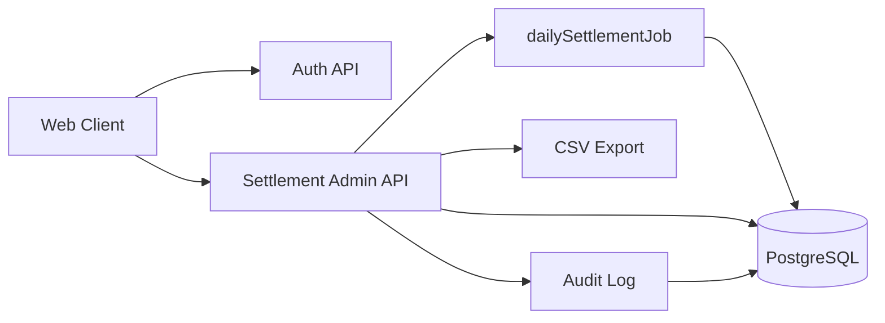

# Settlement Admin API

정산 백오피스 운영 흐름을 Spring Boot 기반으로 구현한 관리자 API 프로젝트입니다. 판매자별 주문/환불 데이터를 일별로 집계하고, 정산 재계산, 확정, CSV 다운로드, 감사 로그, JWT 인증까지 백오피스에서 자주 필요한 흐름을 한 레포 안에서 확인할 수 있게 구성했습니다.

> 포트폴리오 관점에서는 단순 관리자 CRUD가 아니라, 정산 도메인의 “집계 → 검증 → 확정 → 추적” 과정을 API와 웹 클라이언트로 연결한 프로젝트입니다.

<p align="center">
  
</p>

## Highlights

- **정산 워크플로 구현**: 주문/환불 집계, 수수료 계산, 정산 항목 생성, 확정 처리
- **Spring Batch 기반 일별 정산**: `dailySettlementJob`으로 특정 날짜의 판매자별 정산 생성
- **재계산/버전 관리**: 정산 재실행 시 이전 결과와 구분되는 버전 기반 정산 기록
- **JWT 관리자 인증**: 로그인 후 Bearer Token으로 관리자 API 보호
- **감사 로그**: 확정, 재계산, 배치 실행 등 운영 이벤트 추적
- **CSV Export**: 정산 결과와 항목을 파일로 내려받아 운영 검증 가능
- **웹 클라이언트 추가**: 정산 조회, 배치 실행, 확정, 항목 확인을 브라우저에서 수행

## Tech Stack

| 영역 | 사용 기술 |
| --- | --- |
| Language | Java 17 |
| Backend | Spring Boot 4, Spring MVC, Spring Data JPA |
| Batch | Spring Batch |
| Security | Spring Security, JWT, BCrypt |
| Database | PostgreSQL |
| Migration | Flyway |
| Documentation | Springdoc OpenAPI, Swagger UI |
| Infra | Docker Compose, GitHub Actions |
| Web Client | HTML, CSS, Vanilla JavaScript |

## System Overview



## Web Client

웹 클라이언트는 백오피스 담당자가 하루 정산을 확인하는 흐름을 기준으로 구성했습니다. 로그인 후 정산 목록을 조회하고, 필요한 날짜의 배치를 실행하고, 생성된 정산의 항목을 확인한 뒤 확정 또는 CSV 다운로드까지 이어집니다.

<p align="center">
  
</p>

### UI Planning

- 첫 화면에서 로그인, 조회 조건, 정산 목록을 바로 확인할 수 있게 배치했습니다.
- 정산 목록에는 총 지급액, 대기 건수, 대상 정산 수를 함께 보여줘 운영자가 우선순위를 빠르게 판단할 수 있게 했습니다.
- 우측 패널에는 일별 배치 실행, 상세 항목, 처리 로그를 모아 “조회 → 실행 → 검증” 흐름이 끊기지 않게 구성했습니다.
- 색상은 무채색 중심으로 낮추고, 상태/버튼만 제한적으로 강조해 실제 운영 도구에 가까운 밀도를 유지했습니다.

## Core Workflow

1. 관리자가 `/auth/login`으로 토큰을 발급받습니다.
2. `/admin/batch/daily-settlement`로 특정 날짜의 정산 배치를 실행합니다.
3. 배치는 판매자별 주문/환불을 집계하고 `Settlement`, `SettlementItem`을 생성합니다.
4. 관리자는 `/admin/settlements`에서 정산 목록을 조회합니다.
5. 정산 항목을 확인한 뒤 `/admin/settlements/confirm`으로 확정합니다.
6. 필요 시 `/admin/settlements/{id}/export.csv`로 결과를 내려받습니다.

## API Summary

| Method | Endpoint | 설명 |
| --- | --- | --- |
| `POST` | `/auth/login` | 관리자 로그인 및 JWT 발급 |
| `GET` | `/admin/settlements` | 정산 목록 조회 |
| `GET` | `/admin/settlements/{id}` | 정산 단건 조회 |
| `GET` | `/admin/settlements/{id}/items` | 정산 항목 조회 |
| `POST` | `/admin/settlements/confirm` | 정산 확정 |
| `POST` | `/admin/settlements/rerun` | 특정 판매자/날짜 정산 재계산 |
| `GET` | `/admin/settlements/{id}/export.csv` | 정산 CSV 다운로드 |
| `POST` | `/admin/batch/daily-settlement` | 일별 정산 배치 실행 |

## Local Run

```bash
docker compose up -d --build
```

접속 정보:

| 항목 | 값 |
| --- | --- |
| Web Client | `http://localhost:18080` |
| Swagger UI | `http://localhost:18080/swagger-ui/index.html` |
| PostgreSQL | `localhost:15432` |
| Admin Account | `admin1 / password1` |

로컬 Gradle 실행:

```bash
./gradlew bootRun --args='--spring.profiles.active=dev --server.port=18080'
```

## Security

- `/auth/**`, `/swagger-ui/**`, `/v3/api-docs/**`, 정적 웹 리소스만 공개합니다.
- 관리자 API는 JWT Bearer Token이 있어야 접근할 수 있습니다.
- 비밀번호는 BCrypt로 해시해 저장합니다.
- Spring Security는 stateless 세션 정책을 사용합니다.

## Batch Design

`dailySettlementJob`은 정산일을 기준으로 판매자별 주문과 환불을 집계합니다. 각 판매자 단위로 정산 결과를 만들고, 실패 상황은 감사 로그로 남겨 운영자가 추적할 수 있게 했습니다.

```text
orders/refunds
  -> dailySettlementJob
  -> settlement
  -> settlement_item
  -> confirm/export
```

## CI

GitHub Actions에서 Gradle 테스트를 실행합니다.

```text
.github/workflows/ci.yml
```

## Portfolio Notes

이 프로젝트에서 어필하고 싶은 지점은 다음과 같습니다.

- 정산 도메인을 단순 CRUD가 아닌 배치/확정/재계산/감사 로그 흐름으로 설계한 점
- JWT와 Spring Security를 적용해 관리자 API를 보호한 점
- Flyway로 스키마 변경 이력을 관리한 점
- CSV Export와 Swagger UI로 운영 검증과 API 확인 편의성을 제공한 점
- 웹 클라이언트로 백엔드 기능을 실제 백오피스 화면처럼 확인할 수 있게 만든 점

## Repository Structure

```text
.
├── src/main/java/nuts/commerce/settlement
│   ├── domain/batch       # 일별 정산 배치
│   ├── domain/service     # 정산 계산/명령/조회 서비스
│   ├── domain/web         # 관리자 API
│   └── security           # JWT 인증/인가
├── src/main/resources
│   ├── db/migration       # Flyway 마이그레이션
│   └── static             # 웹 클라이언트
├── portfolio              # README용 이미지와 보조 문서
└── docker-compose.yml
```
