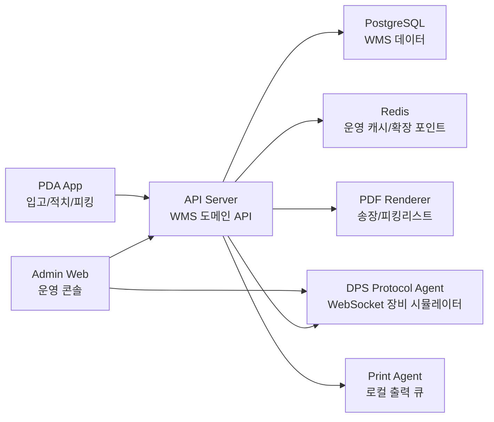
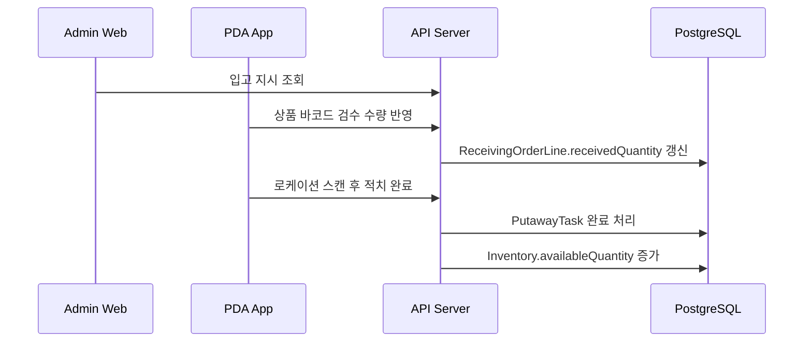
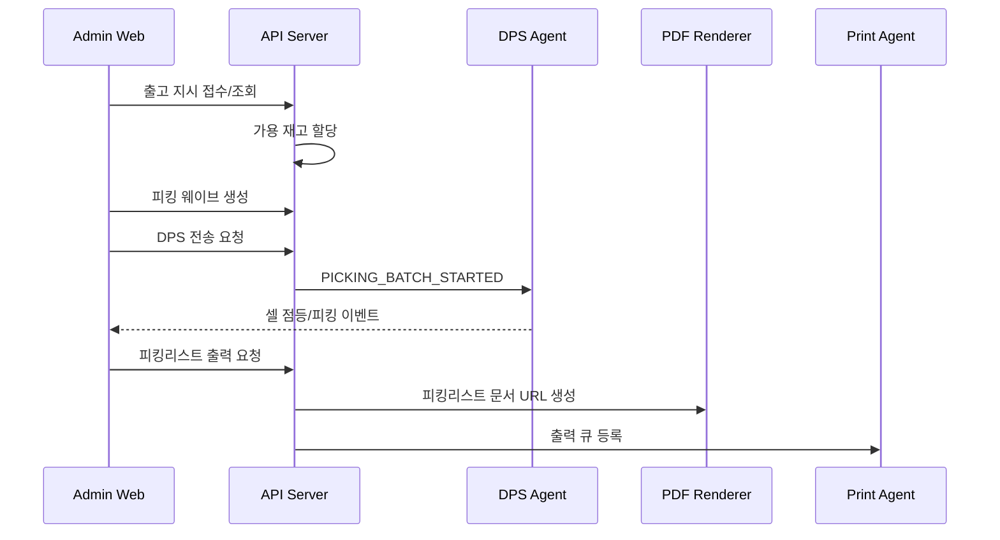

# Warehouse Ops Suite 이력서용 포트폴리오

## 프로젝트 한 줄 소개

**Warehouse Ops Suite**는 3PL 물류센터의 입고, 적치, 재고, 출고 지시, 피킹 웨이브, DPS 장비 연동, PDF 출력, 로컬 프린트 에이전트를 하나의 운영 흐름으로 연결한 WMS 포트폴리오 프로젝트입니다.

회사 코드나 내부 스키마를 사용하지 않고, 실무에서 경험한 WMS/LMS 운영 도메인을 일반화해 새로 설계했습니다.

## 이력서 기재용 요약

```text
3PL WMS 운영 시스템을 클린룸 방식으로 재설계한 포트폴리오 프로젝트입니다.
Admin Web, API Server, PDA App, DPS Protocol Agent, PDF Renderer, Print Agent를 모노레포에 구성하고,
입고/적치, 고객사별 재고, 출고 지시, 피킹 웨이브, DPS 셀 점등, 피킹리스트 출력 큐까지 연결했습니다.
```

## 담당 범위

- 3PL 물류 도메인 모델링: 고객사, 창고, 로케이션, SKU, 재고, 입고 지시, 출고 지시, 피킹 작업
- API Server 설계/구현: Spring Boot, JPA, Flyway, PostgreSQL 기반 WMS 핵심 API
- Admin Web 구현: React, TypeScript, TanStack Query, Tailwind CSS 기반 운영 콘솔
- DPS Protocol Agent 구현: WebSocket 기반 DPS 장비 프로토콜 시뮬레이터
- Print Agent 구현: 로컬 프린터 목록, 출력 큐, 출력 실패 mock
- PDF Renderer 구현: 송장/피킹리스트 HTML/PDF 렌더링 서비스
- Docker 로컬 인프라, GitHub Actions CI, 컴포넌트별 릴리즈 전략 문서화

## 사용 기술

| 영역 | 기술 |
| --- | --- |
| Admin Web | React, TypeScript, Vite, TanStack Query, Tailwind CSS |
| API Server | Kotlin, Spring Boot, JPA, Flyway, PostgreSQL, Redis |
| PDA App | Flutter, Dart |
| DPS Agent | Kotlin, Ktor WebSocket |
| Print Agent | Kotlin, Ktor |
| PDF Renderer | Node.js, TypeScript, Fastify, Playwright |
| Infra/CI | Docker Compose, GitHub Actions, Gradle Wrapper, pnpm workspace |

## 전체 화면 구성

상세 사용자 매뉴얼과 화면별 기능 명세는 [제품 매뉴얼 및 기능 명세](https://github.com/MIMminE/warehouse-ops-suite/blob/main/docs/product-manual.md)에 별도로 정리했습니다. 이력서용 문서에서는 핵심 화면과 설계 의도만 압축해 설명합니다.

## 화면 기반 핵심 기능 명세

| 화면 | 사용자 액션 | 시스템 처리 | 포트폴리오 어필 포인트 |
| --- | --- | --- | --- |
| 운영 현황 | 당일 KPI와 이슈 큐 확인 | 입고/재고/출고/피킹 지표 집계 | 운영 우선순위를 잡는 대시보드 설계 |
| 입고/적치 | 고객사/창고/상태별 입고 조회 | 검수 수량과 적치 수량 분리 표시 | PDA 기반 분할 적치 도메인 표현 |
| 재고 | 로케이션별 재고와 적재율 확인 | 고객사/SKU/로케이션별 수량 조회 | 3PL 고객사 소유 재고 구조 반영 |
| 출고 지시 | 출고 지시 클릭 후 송장 상세 확인 | 헤더/라인/수량 상태 분리 조회 | WMS가 받는 출고 지시와 재고 할당 흐름 설명 |
| 피킹 웨이브 | 웨이브 생성, DPS 전송, 피킹리스트 출력 | PickingTask 생성, WebSocket 전송, PrintJob 등록 | 현장 작업 단위와 로컬 에이전트 연동 |
| DPS 모니터 | 셀 점등/완료 이벤트 확인 | Agent 이벤트 수신 및 상태 갱신 | 장비 프로토콜 시뮬레이션 |
| 시스템 연결 | 중앙 서비스와 로컬 에이전트 확인 | 실행 단위별 endpoint와 상태 표시 | 모노레포 안의 배포 단위 분리 |

### 1. 운영 현황 대시보드

입고 진행, 가용 재고, 출고 지시, 피킹 작업을 한 화면에서 확인하도록 구성했습니다. 단순 통계가 아니라 운영자가 당일 이슈를 먼저 볼 수 있도록 이슈 큐, 고객사별 처리 현황, 최근 입고/출고, 재고 알림을 함께 배치했습니다.


설계 포인트:
- 고객사별 SLA와 운영 이슈를 대시보드 첫 화면에서 확인
- 입고/출고/피킹/재고를 분리하지 않고 현장 운영 흐름 기준으로 요약
- API 연결 실패 시에도 데모 데이터로 화면이 무너지지 않도록 구성

### 2. 입고/적치 화면

입하와 입고는 PDA를 통해 검수하고, 검수된 수량을 로케이션으로 적치하는 방식으로 설계했습니다. 입고 예정 수량, 검수 완료 수량, 적치 완료 수량을 분리해 실제 물류센터의 분할 적치 흐름을 표현했습니다.


설계 포인트:
- 입고 예정, 검수 완료, 적치 완료, 미적치 수량을 분리
- 하나의 입고 상세를 여러 로케이션에 나누어 적치할 수 있는 구조
- PDA 작업 흐름을 Admin Web에서 모니터링하는 형태로 구성

### 3. 재고/로케이션 관리 화면

3PL 환경에서는 고객사별 재고 소유권과 로케이션별 재고 상태를 함께 봐야 합니다. 재고 화면은 고객사, 창고, 상태, 키워드 기준 조회와 함께 로케이션 단위의 적재 현황을 그래픽으로 확인할 수 있게 구성했습니다.


설계 포인트:
- 고객사별 재고, 가용 수량, 할당 수량, 보류 수량 분리
- 로케이션별 적재율과 상태를 시각적으로 표현
- 출고 할당 가능 수량과 현장 보류 재고를 한 화면에서 비교 가능

### 4. 출고 지시 및 송장 상세

WMS가 외부 주문 전체 수집을 담당하기보다, OMS/쇼핑몰/ERP에서 넘어온 출고 지시를 받아 재고 할당과 피킹으로 연결하는 구조로 잡았습니다. 출고 지시를 클릭하면 하위 송장/상품/할당/피킹 상태를 확인할 수 있습니다.


설계 포인트:
- API, CSV, EDI, 수기 입력 등 다양한 출고 지시 유입 방식을 고려
- 고객사/창고/SKU 검증과 중복 출고 지시 번호 방지
- 출고 지시 헤더와 라인 수량 상태를 분리해 운영 추적 가능

### 5. 피킹 웨이브와 DPS/출력 액션

피킹 웨이브는 여러 출고 지시 라인을 묶어 현장 피킹 단위로 만드는 화면입니다. 선택한 웨이브의 하위 송장과 피킹 작업을 확인하고, DPS 전송과 피킹리스트 출력 요청을 실행할 수 있습니다.


설계 포인트:
- 할당된 출고 지시 라인을 웨이브로 묶고 PickingTask 생성
- 웨이브 상세에서 하위 송장/상품/로케이션/작업자 상태 확인
- DPS Protocol Agent로 WebSocket 전송
- Print Agent 출력 큐에 피킹리스트 출력 작업 등록

### 6. DPS Protocol Agent 모니터

DPS 장비를 실제 하드웨어 없이 시뮬레이션하기 위해 WebSocket 기반 DPS Protocol Agent를 구현했습니다. 셀 점등, 피킹 완료, 실패 상태를 Admin Web에서 확인할 수 있습니다.


설계 포인트:
- API Server가 피킹 웨이브를 DPS 배치 메시지로 변환
- DPS Agent는 셀 점등/완료/실패 이벤트를 WebSocket으로 브로드캐스트
- 운영자는 장비 연결 상태와 셀별 작업 상태를 모니터링

### 7. 시스템 연결 화면

이 프로젝트는 하나의 Git 레포 안에 여러 실행 단위를 둔 모노레포 구조입니다. 각 컴포넌트는 배포 주기와 실행 위치가 다르기 때문에 Admin Web에서 중앙 서비스와 로컬 에이전트를 분리해서 보여주도록 했습니다.


설계 포인트:
- API Server/PDF Renderer는 중앙 서비스로 분리
- DPS Agent/Print Agent/PDA는 현장 또는 로컬 실행 단위로 분리
- 컴포넌트별 릴리즈 주기와 배포 방식을 문서화

## 핵심 아키텍처



## 주요 도메인 흐름

### 입고/적치



### 출고/피킹/DPS/출력



## 구현 결과

| 항목 | 구현 상태 |
| --- | --- |
| 고객사별 3PL 재고 모델 | 완료 |
| 입고/검수/분할 적치 모델 | 완료 |
| 출고 지시 접수/조회/할당 | 완료 |
| 피킹 웨이브 생성/조회 | 완료 |
| DPS WebSocket 전송 | 완료 |
| PDF Renderer | 완료 |
| Print Agent 출력 큐 | 완료 |
| Admin Web 운영 화면 | 완료 |
| PDA App | MVP 화면 |
| Docker 로컬 인프라 | 완료 |
| GitHub Actions CI | 완료 |

## 검증

로컬 통합 검증 명령:

```bash
pnpm verify
```

검증 범위:
- Admin Web lint/build
- PDF Renderer build
- TypeScript workspace typecheck
- API Server test
- Print Agent/DPS Agent Gradle test task

GitHub Actions:
- CI Admin Web
- CI API Server
- CI Local Agents

## 이 프로젝트로 설명할 수 있는 역량

- 도메인 경험을 회사 코드 없이 재해석해 제품 구조로 설계하는 능력
- 단순 CRUD가 아닌 WMS 상태 전이, 수량 검증, 재고 할당 흐름을 모델링하는 능력
- Web/API/Agent/PDF/PDA 등 여러 실행 단위를 연결하는 시스템 설계 능력
- 현장 장비와 로컬 에이전트를 고려한 운영 시스템 UX 설계 능력
- 포트폴리오에서도 CI, 릴리즈 전략, 문서화까지 포함해 완성도를 관리하는 습관

## 면접 설명 스크립트

이 프로젝트는 제가 실무에서 경험한 물류 운영 흐름을 회사 코드 없이 새로 재설계한 WMS 포트폴리오입니다.
3PL 구조를 기준으로 고객사별 재고와 출고 지시를 분리했고, 입고 검수, 로케이션 적치, 재고 할당, 피킹 웨이브, DPS 장비 전송, 피킹리스트 출력까지 하나의 흐름으로 연결했습니다.

특히 단일 웹 CRUD가 아니라 Admin Web, API Server, PDA App, DPS Protocol Agent, PDF Renderer, Print Agent를 각각 독립 실행 단위로 두었습니다.
현장 장비나 로컬 프린터처럼 중앙 서버만으로 해결하기 어려운 부분을 별도 에이전트로 분리했고, WebSocket과 HTTP API로 연결했습니다.

포트폴리오 목적상 실제 택배사 API나 프린터 드라이버 연동은 mock으로 처리했지만, 운영 시스템에서 중요한 상태 관리, 실패 처리, 큐 관리, 컴포넌트별 릴리즈 전략은 실제 구조에 가깝게 설계했습니다.

## 남겨둔 확장 포인트

- 사용자 인증/권한과 고객사별 접근 제어
- 실제 PDA 바코드 스캐너 연동
- 실제 택배사 송장 API 연동
- Print Agent의 OS별 프린터 드라이버 제어
- AWS ECS/RDS/ElastiCache 기반 배포
- OpenTelemetry 기반 관측 가능성 구성
