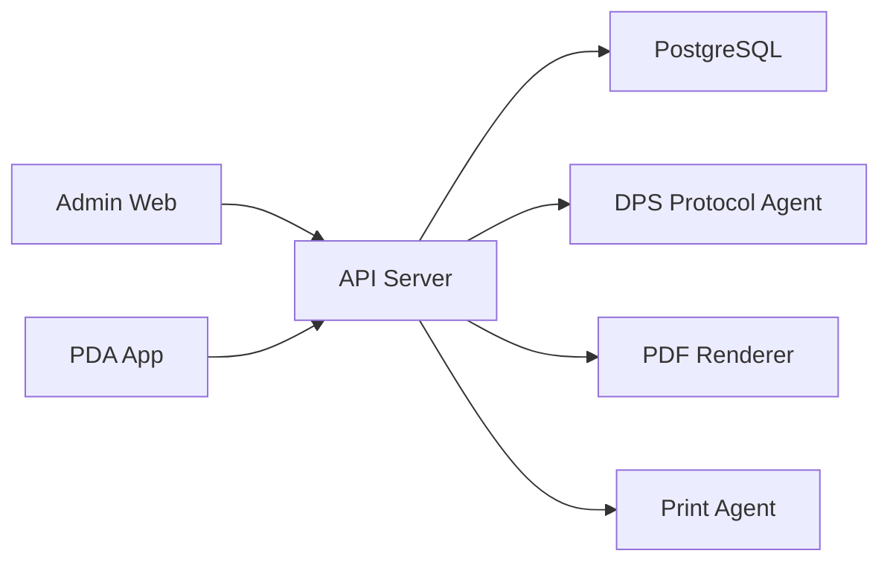
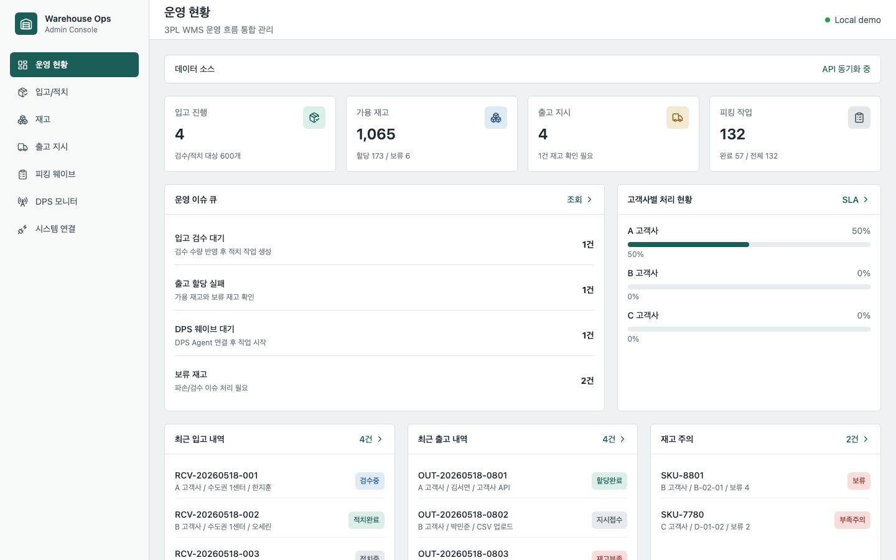
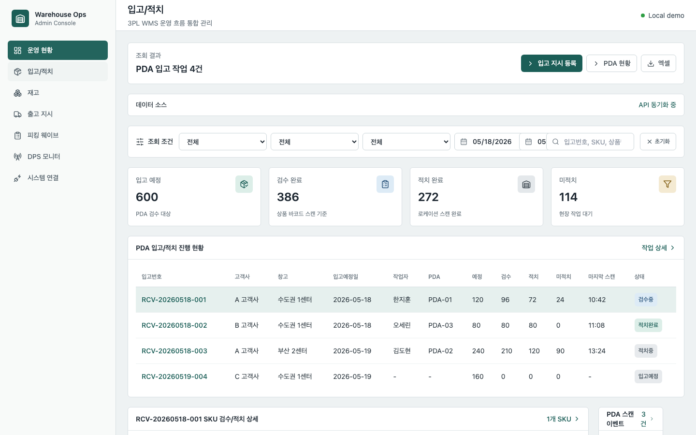
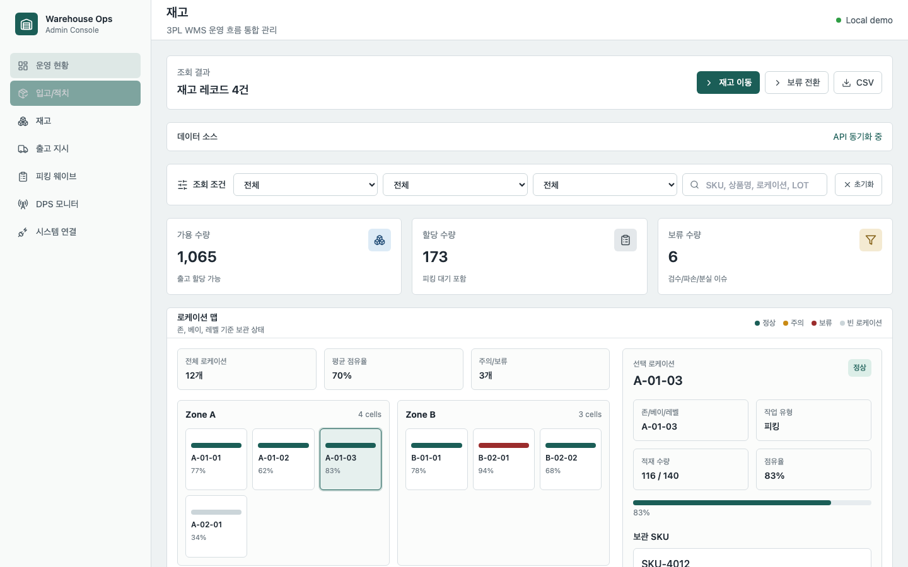
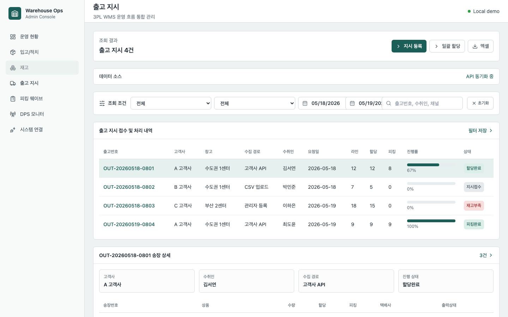
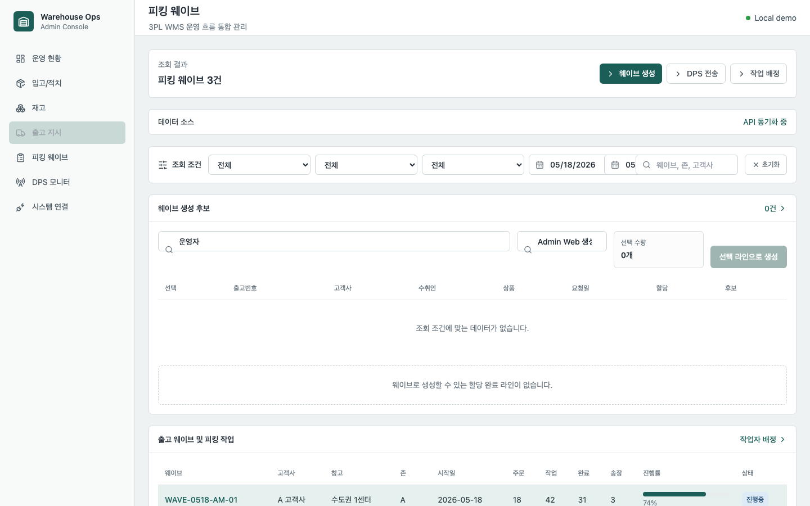
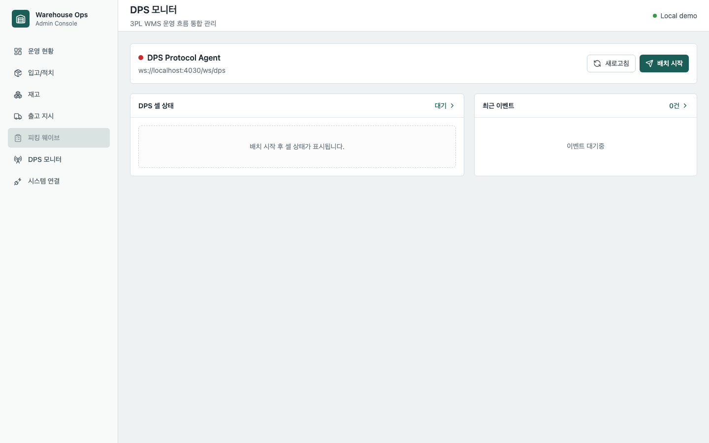
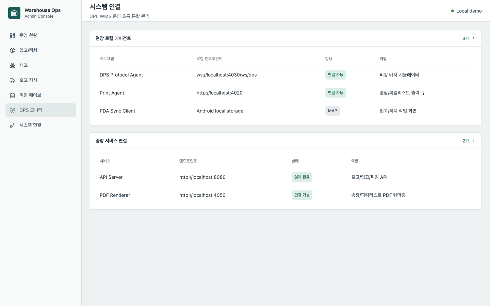

# Warehouse Ops Suite

물류센터 운영 시스템은 CRUD 화면 몇 개로 설명하기 어렵습니다. 입고 예정 수량과 실제 검수 수량은 다를 수 있고, 검수된 상품은 여러 로케이션으로 나뉘어 적치됩니다. 출고도 주문 번호 하나로 끝나지 않습니다. 출고 지시, 재고 할당, 피킹 웨이브, DPS 장비, 피킹리스트 출력, 현장 PDA 작업까지 이어집니다.

Warehouse Ops Suite는 이런 3PL 물류센터의 운영 흐름을 포트폴리오용으로 재설계한 WMS 프로젝트입니다. 회사 코드나 실제 고객사 데이터는 사용하지 않고, 실무에서 만날 수 있는 물류 운영 문제를 일반화해 도메인 모델, API, 관리자 화면, 현장 에이전트 구조로 다시 구성했습니다.

## 이 프로젝트에서 보여주고 싶었던 것

WMS는 단순히 재고 수량을 저장하는 시스템이 아닙니다. 운영자가 "오늘 어떤 입고를 먼저 처리해야 하는지", "어떤 출고가 재고 부족으로 멈췄는지", "피킹 웨이브가 현장 장비까지 제대로 전달됐는지"를 판단할 수 있어야 합니다.

그래서 이 프로젝트는 기능 개수를 늘리는 것보다, 물류센터 운영에서 상태가 어떻게 바뀌고 작업 단위가 어떻게 쪼개지는지를 화면과 API 구조로 보여주는 데 집중했습니다.

## 전체 실행 단위

Warehouse Ops Suite는 하나의 레포 안에 여러 실행 단위를 둔 멀티 애플리케이션 구조입니다.

| 실행 단위 | 역할 |
| --- | --- |
| Admin Web | 운영자가 입고, 재고, 출고, 피킹, 에이전트 상태를 보는 관리자 화면 |
| API Server | WMS 핵심 도메인 API와 상태 전이 처리 |
| PDA App | 입고 검수, 로케이션 적치, 피킹 작업을 수행하는 현장 앱 |
| DPS Protocol Agent | DPS 장비 프로토콜을 WebSocket으로 시뮬레이션 |
| Print Agent | 로컬 PC에서 프린터 목록과 출력 큐를 관리 |
| PDF Renderer | 송장, 피킹리스트 같은 출력 문서를 생성 |

중앙 서비스와 현장 에이전트를 분리한 이유는 배포 위치와 장애 대응 방식이 다르기 때문입니다. API Server와 PDF Renderer는 중앙 인프라에 둘 수 있지만, 프린터나 DPS 같은 현장 장비 연동은 로컬 네트워크와 장비 상태에 크게 의존합니다.



## 운영 현황: 오늘 무엇을 먼저 처리할까

운영 현황 화면은 입고, 재고, 출고, 피킹 상태를 한 화면에서 확인하도록 만들었습니다.



단순 KPI 카드만 두면 운영자는 숫자를 본 뒤 다시 각 메뉴로 들어가야 합니다. 그래서 이슈 큐와 고객사별 처리 현황을 함께 배치했습니다. 입고 검수 대기, 출고 할당 실패, DPS 웨이브 대기, 보류 재고처럼 바로 조치가 필요한 항목을 먼저 보이게 했습니다.

이 화면에서 의도한 것은 "대시보드가 예쁜가"가 아니라 "운영자가 다음 행동을 결정할 수 있는가"입니다.

## 입고와 적치: 예정 수량과 실제 작업 수량을 분리하기

입고는 예정 수량을 등록하는 것으로 끝나지 않습니다. 실제 현장에서는 PDA로 상품을 검수하고, 검수된 수량을 로케이션에 나누어 적치합니다.



그래서 입고 상세는 예정 수량, 검수 수량, 적치 수량을 분리해서 모델링했습니다.

| 모델 | 설명 |
| --- | --- |
| ReceivingOrder | 입고 지시 헤더 |
| ReceivingOrderLine | SKU별 입고 예정/검수 수량 |
| PutawayTask | 특정 입고 상세 수량을 특정 로케이션으로 적치하는 작업 |
| Inventory | 적치 완료 후 증가하는 고객사별 재고 |

예를 들어 100개가 입고되었더라도 한 번에 한 로케이션으로 들어가지 않을 수 있습니다. A 로케이션에 40개, B 로케이션에 60개를 적치하는 흐름이 필요합니다. 이 구조를 표현하기 위해 하나의 입고 상세에 여러 `PutawayTask`가 연결될 수 있게 했습니다.

## 재고와 로케이션: 3PL에서는 소유자가 중요하다

3PL 환경에서는 물리적 위치만큼 재고 소유 고객사도 중요합니다. 같은 SKU처럼 보여도 고객사가 다르면 별도의 재고로 봐야 하고, 가용 수량과 할당 수량도 분리되어야 합니다.



재고 화면은 고객사, 창고, 로케이션, SKU를 기준으로 재고를 좁혀볼 수 있게 구성했습니다. 로케이션 현황은 적재율과 상태를 함께 보여주어, 특정 구역에 재고가 몰리거나 보류 재고가 쌓이는 상황을 빠르게 파악할 수 있게 했습니다.

## 출고 지시: WMS가 받는 입력을 정의하기

이 프로젝트에서 WMS는 쇼핑몰 주문 수집 시스템이 아니라 출고 지시를 받는 시스템으로 정의했습니다. 고객사 OMS, 쇼핑몰, ERP, CSV 업로드, 관리자 수기 등록 등 다양한 경로에서 출고 지시가 들어올 수 있고, WMS는 이를 검증한 뒤 재고 할당과 피킹으로 연결합니다.



출고 지시 접수에서 중요한 검증은 세 가지입니다.

- 고객사, 창고, SKU가 실제 존재하는지 확인
- 같은 고객사의 출고 지시 번호가 중복되지 않는지 확인
- 출고 라인별 요청 수량이 재고 할당 가능한 상태인지 확인

출고 지시는 헤더와 라인을 분리했습니다. 라인에는 요청 수량, 할당 수량, 피킹 수량을 따로 둬서 작업 진행 상태를 추적할 수 있게 했습니다.

## 피킹 웨이브: 출고 지시를 현장 작업으로 묶기

피킹 웨이브는 여러 출고 지시 라인을 현장 작업 단위로 묶는 과정입니다. 운영자는 웨이브를 선택해 하위 송장과 상품 라인을 확인하고, DPS 전송이나 피킹리스트 출력 같은 현장 액션을 실행할 수 있습니다.



웨이브 생성 흐름은 다음과 같이 잡았습니다.

```text
출고 지시 접수
-> 재고 할당
-> 출고 지시 라인 선택
-> PickingWave 생성
-> PickingTask 생성
-> DPS 전송 또는 PDA 피킹
```

관리자 화면에서는 웨이브 단위의 진행 상태를 보고, PDA나 DPS 에이전트는 실제 작업 단위인 `PickingTask`를 처리합니다. 이렇게 나누면 운영 화면과 현장 작업 앱이 같은 데이터를 각자의 관점에서 사용할 수 있습니다.

## DPS Protocol Agent: 실제 장비 없이 장비 연동 흐름 보여주기

DPS는 피킹 위치의 셀을 점등해 작업자가 어떤 상품을 집어야 하는지 안내하는 장비입니다. 실제 하드웨어를 포트폴리오에서 사용할 수 없기 때문에 WebSocket 기반 프로토콜 에이전트로 장비 이벤트를 시뮬레이션했습니다.



API Server는 피킹 웨이브를 DPS 배치 메시지로 변환하고, DPS Agent는 점등, 완료, 실패 이벤트를 다시 브로드캐스트합니다. Admin Web은 연결 상태와 셀별 작업 상태를 확인합니다.

이 부분은 "외부 장비를 어떻게 추상화할 것인가"를 보여주기 위한 장치입니다.

## 시스템 연결과 배포 단위

이 프로젝트는 모노레포지만 하나의 애플리케이션은 아닙니다. 실행 위치와 릴리즈 주기가 다른 프로그램들이 함께 있습니다.



배포 관점에서는 다음 기준을 두었습니다.

| 구분 | 예시 | 배포 특성 |
| --- | --- | --- |
| 중앙 서비스 | API Server, PDF Renderer | 서버 인프라에 배포 |
| 웹 클라이언트 | Admin Web | 정적 빌드 또는 CDN 배포 |
| 현장 앱 | PDA App | Android 기기 배포 |
| 로컬 에이전트 | Print Agent, DPS Agent | 센터 PC 또는 현장 네트워크에 설치 |

## 블로그 포스팅 패키지

이 프로젝트는 Portfolio Hub에 게시하기 위해 `blog/` 패키지를 별도로 둡니다.

```text
blog/article.md
blog/images/*
.portfolio/manifest.json
-> dist/portfolio-package/
-> S3 portfolio-feed
-> Portfolio Hub
```

포스팅 업로드는 자동 push가 아니라 수동 GitHub Actions 워크플로우로만 실행되도록 구성했습니다. 게시물로 노출할 준비가 되었을 때만 S3에 업로드하고, 허브는 S3의 feed index와 manifest를 읽어 글을 렌더링합니다.

## 구현 범위

| 영역 | 구현 상태 |
| --- | --- |
| 고객사별 재고 모델 | 완료 |
| 입고/검수/분할 적치 | 완료 |
| 출고 지시 접수/조회 | 완료 |
| 재고 할당 | 완료 |
| 피킹 웨이브 | 완료 |
| DPS WebSocket 연동 | 완료 |
| PDF Renderer | 완료 |
| Print Agent 출력 큐 | 완료 |
| PDA App | MVP |
| 포트폴리오 패키지 CI | 대표 프로젝트 구성 |

대표 검증 명령은 다음과 같습니다.

```bash
pnpm portfolio:package
pnpm typecheck
```

## 회고

이 프로젝트를 만들면서 가장 중요하게 생각한 것은 "물류 도메인을 얼마나 그럴듯하게 말할 수 있는가"가 아니라 "작업 상태를 시스템으로 어떻게 표현할 수 있는가"였습니다.

입고, 적치, 출고, 피킹, 장비 연동은 모두 상태 전이가 있습니다. 그리고 그 상태는 운영자, 현장 작업자, 외부 장비가 서로 다른 방식으로 바라봅니다. Warehouse Ops Suite는 그 차이를 화면과 실행 단위, 도메인 모델로 분리해 보여주는 포트폴리오입니다.

실제 운영 수준으로 확장한다면 고객사별 사용자 권한, 실제 PDA 바코드 스캐너, 택배사 송장 API, OS별 프린터 드라이버 제어, OpenTelemetry 기반 관측 가능성까지 이어갈 수 있습니다.
